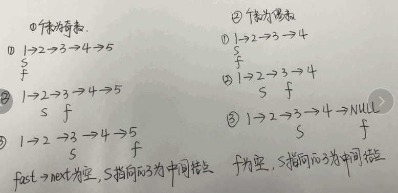

#### 网址: [leetcode-cn](https://leetcode-cn.com/problemset/all/)

#### 目录: 

* [数组和字符串](#1)
    * [1. 搜索旋转排序数组](https://leetcode-cn.com/problems/search-in-rotated-sorted-array/)
    * [2. 有序数组的平方](https://leetcode-cn.com/problems/squares-of-a-sorted-array/)
* [链表](#2)
    * [1. 两两交换链表中的结点](https://leetcode-cn.com/problems/swap-nodes-in-pairs/)
    * [2. 重排链表](https://leetcode-cn.com/problems/reorder-list/)
    * [3. 回文链表](https://leetcode-cn.com/problems/palindrome-linked-list/)
* [树与二叉树](#3)
* [队列和栈](#4)
* [堆](#5)
* [二分法](#6)
* [递归与回溯](#7)
* [并查集](#8)
* [位运算](#9)
* [深度优先搜索和广度优先搜索](#10)
* [动态规划](#11)
* [数学题](#12)

***

<h2 id="1"> 1. 数组和字符串 </h2>

**前言: 关于数组和字符串的题，个人认为是最难的，因为它不像链表、二叉树、DFS/BFS等那种有解题套路的题目，数组背景可以衍生出很多很多的算法题，甚至是找规律和数学类型的题，所以对于数组这个模块，我的想法是只需要掌握一些经典的算法，然后多积累即可。**

[1. 搜索旋转排序数组](https://leetcode-cn.com/problems/search-in-rotated-sorted-array/)

这一题看到对时间复杂度的要求，应该就可以想到要用"二分法来求解"。但是二分法要求原始序列是有序的，怎么办呢?

对于下面这个例子: nums: [4,5,6,7,0,1,2]

如果我们能先找到它的旋转点nums[4] = 0，以nums[4]为中间点，不就把原始的数组分成了两个有序的数组: 

nums[0, ..., 3]、nums[4, ..., 6]，然后再到这两个有序数组中就可以使用二分查找了。

下面的难点是如下寻找旋转点 --- 还是用二分查找法:
对于旋转点来说，它一定满足它的前一个元素>旋转点，mid = left + (right - left) / 2

若nums[mid - 1] > nums[mid]: 则mid对应的二元素为旋转点
若nums[mid] > nums[mid + 1]: 则mid + 1对应的元素为旋转点
若nums[left] > nums[mid]: 假设nums[left] = 4, nums[mid] = 2，则旋转点一定在mid的左边，则置right = mid - 1
若nums[left] < nums[mid]: 假设nums[left] = 4, nums[mid] = 7，则旋转点一定在mid的右边，则置left = mid + 1

```cpp
class Solution {
public:
    // 找到旋转点
    int searchPivot(vector<int>& nums) {
        int left = 0, right = nums.size()-1, mid = -1;
        while(left < right) {
            mid = left + (right - left) / 2;
            if(mid-1 >= 0 && nums[mid-1] > nums[mid])
                return mid;
            else if(mid+1 < nums.size() && nums[mid] > nums[mid+1])
                return mid+1;
            else if(nums[left] < nums[mid])
                left = mid + 1;
            else if(nums[left] > nums[mid])
                right = mid - 1;
        }
        return left;
    }

    int searchTarget(vector<int>& nums, int left, int right, int target) {
        int mid = -1;
        while(left <= right) {
            mid = left + (right - left) / 2;
            if(target == nums[mid]) {
                return mid;
            }
            else if(nums[mid] > target) {
                right = mid - 1;
            }
            else {
                left = mid + 1;
            }
        }
        return -1;
    }

    int search(vector<int>& nums, int target) {
        if(nums.size() == 0) {
            return -1;
        }

        int N = nums.size();
        if(nums[0] <= nums[N-1]) {
            return searchTarget(nums, 0, N-1, target);
        }
        else {
            int pivot = searchPivot(nums);
            if(target >= nums[0]) {
                return searchTarget(nums, 0, pivot-1, target);
            }
            else {
                return searchTarget(nums, pivot, nums.size()-1, target);
            }
        }
    }
};
```

[2. 有序数组的平方](https://leetcode-cn.com/problems/squares-of-a-sorted-array/)

解法1：直接排序

最简单直接的解法就是对数组中的所有元素先平方，然后排序，时间复杂度为$O(nlogn)$。但是，这个解法显然不是面试官想要的。

**解法2：双指针 >>> 时间复杂度为$O(n)$的解法**

以[-4, -1, 0, 3, 10]为例: 

* 如果所有的数都是正数，那么越大的数，平方就越大
* 如果所有的数都是负数，那么越大的数，平方就越小

可以用两个指针i、j分别指向最大的负数、最小的正数，然后取平方后比较小的那个数即可。

```cpp
class Solution {
public:
    vector<int> sortedSquares(vector<int>& A) {
        int i = -1, j = 0;
        // O(n)的时间复杂度找到负数、正数的分界处
        for(int k = 0; k < A.size(); k++) {
            if(k+1 < A.size() && A[k] < 0 && A[k+1] >= 0) {
                i = k;
                j = k+1;
            }
        }
        vector<int> res(A.size(), 0);
        int k = 0;
        while(i >= 0 && j < A.size()) {
            int i_i = A[i] * A[i], j_j = A[j] * A[j];
            if(i_i < j_j) {
                res[k++] = i_i;
                i--;
            }
            else {
                res[k++] = j_j;
                j++;
            }
        }

        while(i >= 0) {
            res[k++] = A[i] * A[i--];
        }

        while(j < A.size()) {
            res[k++] = A[j] * A[j++];
        }

        return res;
    }
};
```


<h2 id="2"> 2. 链表 </h2>

**前言: 链表包含单链表、双向链表、循环链表，在解答相关的题目的时候，把图画出来，仔细一点一般没有什么问题**。这里总结一下链表相关的经典算法题有哪些: 

* 回文链表 (快慢指针)
* 链表反转
* 有序链表合并
* 环形链表 (快慢指针的应用)

[1. 两两交换链表中的结点](https://leetcode-cn.com/problems/swap-nodes-in-pairs/)

假设p、p_next为两个待交换的结点，要保证链表不断，还需要知道p的前驱结点pre、p_next的后继结点p_next_next，思路如下: 

* p为头结点的情况，前驱结点为空，不好处理。因此需要手动给链表添加一个新的头结点newHead。
* p、p_next都不为空才能进行交换

```cpp
class Solution {
public:
    ListNode* swapPairs(ListNode* head) {
        if(!head || !head->next) {
            return head;
        }
        ListNode *newHead = new ListNode(0);
        newHead->next = head;

        ListNode *pre = newHead, *p = head, *p_next = head->next;
        while(p && p_next) {
            ListNode *p_next_next = p_next->next;
            // 结点交换
            pre->next = p_next;
            p_next->next = p;
            p->next = p_next_next;
            // pre和p同步往后移动
            pre = p;
            p = p_next_next;
            p_next = p ? p->next : nullptr;
        }
        return newHead->next;
    }
};
```

[2. 重排链表](https://leetcode-cn.com/problems/reorder-list/)

假设给定链表为 1 -> 2 -> 3 -> 4，首先我们**找到链表的中间结点**，将原始链表拆分为两个链表1 -> 2、3 -> 4，然后将第2个**链表反转**，再依次插入到第1个链表中。

主要是下面三个重要的点: 

* 找到链表的中间结点  >>>  快慢指针
* 链表反转
* 链表合并

```cpp
class Solution {
public:
    // 链表反转
    ListNode* reverseList(ListNode *head) {
        ListNode *pre = nullptr, *cur = head, *cur_next = nullptr;
        while(cur) {
            cur_next = cur->next;
            cur->next = pre;
            pre = cur;
            cur = cur_next;
        }
        return pre;
    }

    void reorderList(ListNode* head) {
        if(!head || !head->next) 
            return;
        
        ListNode *slow = head, *fast = head;
        // 快慢指针寻找中间结点
        while(fast && fast->next) {
            slow = slow->next;
            fast = fast->next->next;
        }
        // 将原链表拆分为两个链表head、head2，head1的长度 >= head2
        ListNode *head2 = slow->next;
        slow->next = nullptr;
        // 链表2反转
        head2 = reverseList(head2);

        slow = head, fast = head2;
        while(fast) {
            ListNode *node = fast;
            fast = fast->next;

            node->next = slow->next;
            slow->next = node;

            slow = node->next;
        }
    }
};
```

[3. 回文链表](https://leetcode-cn.com/problems/palindrome-linked-list/)

所谓的回文链表就是以中间结点为对称轴，表现出对称的特性的链表。比如说: 

* [1, 2, 2, 1]
* [1, 2, 3, 2, 1]

比较容易想到的解法就是利用栈的反向特性，先遍历链表并加入到栈中，然后依次出栈并且与链表的头结点开始比较。这样的做法的复杂度如下: 

* 空间复杂度: $O(n)$
* 时间复杂度: $O(n)$

下面是一种空间复杂度为$O(1)$的解法。以[1, 2, 2, 1]为例。

先将原始链表从中间结点分开，得到两个链表[1, 2]、[2, 1]，然后将第二个链表反转，得到[1, 2]、[1, 2]，再依次从头开始遍历，比较每个结点是否相等。

下面的问题就是: 

* 如何找到链表的中间结点
* 如何将链表进行反转

**寻找链表的中间结点 >>> 快慢指针**

用两个指针slow、fast都指向链表的第一个结点，slow的步长为1，fast的步长为2，当fast == NULL 或 fast->next == NULL的时候，slow指向的就是链表的中间结点。

图示如下: 



然后需要注意的是: 在将原始链表拆分为两个链表的情况下

* 当fast == NULL，slow指向的结点就是第2个链表的头结点，此时原始链表的结点个数为偶数
* 当fast->next == NULL，slow->next指向的结点是第2个链表的头结点，此时原始链表的结点个数为奇数

完整代码如下: 

```cpp
class Solution {
public:
    // 链表反转
    ListNode* reverseList(ListNode* head) {
        ListNode *pre = nullptr, *cur = head, *cur_next = nullptr;
        while(cur) {
            cur_next = cur->next;
            cur->next = pre;
            pre = cur;
            cur = cur_next;
        }
        return pre;
    }

    bool isPalindrome(ListNode* head) {
        // 如果链表为空，或者只有一个结点，则为回文链表
        if(!head || !head->next) {
            return true;
        }

        ListNode *slow = head, *fast = head;
        // 快慢指针寻找中间结点
        while(fast && fast->next) {
            slow = slow->next;
            fast = fast->next->next;
        }
		// 将原始链表拆分为两个链表
        ListNode *head2 = fast ? slow->next : slow;
        // 链表2反转
        head2 = reverseList(head2);
        
        slow = head, fast = head2;
        // 从头开始遍历链表1和链表2，判断每个结点的值是否相等
        while(fast) {
            if(slow->val != fast->val)
                return false;
            slow = slow->next;
            fast = fast->next;
        }
        return true;
    }
};
```


<h2 id="3">3. 树与二叉树</h2>


<h2 id="4">4. 队列和栈</h2>


<h2 id="5">5. 堆</h2>


<h2 id="6">6. 二分法</h2>


<h2 id="7">7. 递归与回溯</h2>


<h2 id="8">8. 并查集</h2>


<h2 id="9">9. 位运算</h2>


<h2 id="10">10. 深度优先搜索与广度优先搜索</h2>


<h2 id="11">11. 动态规划</h2>


<h2 id="12">12. 数学题</h2>