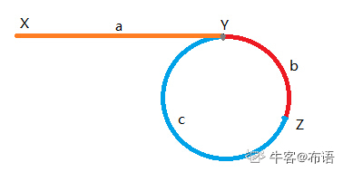

#### 网址: [牛客网_研发最爱考](https://www.nowcoder.com/ta/job-code-high-rd)

#### 目录

* 数组和字符串
    * [1.  字符串数组中的最长公共前缀](https://www.nowcoder.com/practice/28eb3175488f4434a4a6207f6f484f47?tpId=190&&tqId=35964&rp=1&ru=/ta/job-code-high-rd&qru=/ta/job-code-high-rd/question-ranking)
    * [2. 调整数组元素顺序使得奇数位于偶数前面](https://www.nowcoder.com/practice/beb5aa231adc45b2a5dcc5b62c93f593?tpId=190&&tqId=35985&rp=1&ru=/ta/job-code-high-rd&qru=/ta/job-code-high-rd/question-ranking)
    * [3. 数组元素拼接成最大数](https://www.nowcoder.com/practice/fc897457408f4bbe9d3f87588f497729?tpId=190&&tqId=36031&rp=1&ru=/ta/job-code-high-rd&qru=/ta/job-code-high-rd/question-ranking)
    * [4. 合并区间](https://www.nowcoder.com/practice/69f4e5b7ad284a478777cb2a17fb5e6a?tpId=190&&tqId=35348&rp=1&ru=/ta/job-code-high-rd&qru=/ta/job-code-high-rd/question-ranking)
    * [5. 数组中的最长连续子序列](https://www.nowcoder.com/practice/eac1c953170243338f941959146ac4bf?tpId=190&&tqId=35393&rp=1&ru=/ta/job-code-high-rd&qru=/ta/job-code-high-rd/question-ranking)
    * [6. 找到字符串的最长无重复字符子串](https://www.nowcoder.com/practice/b56799ebfd684fb394bd315e89324fb4?tpId=190&&tqId=35220&rp=1&ru=/ta/job-code-high-rd&qru=/ta/job-code-high-rd/question-ranking)
    * [7. 大数乘法](https://www.nowcoder.com/practice/c4c488d4d40d4c4e9824c3650f7d5571?tpId=190&&tqId=36035&rp=1&ru=/ta/job-code-high-rd&qru=/ta/job-code-high-rd/question-ranking)
* 堆
    * [1. 随时找到数据流的中位数](https://www.nowcoder.com/practice/8c5e99acb1fa4bc3a342cd321100c0cd?tpId=190&&tqId=36009&rp=1&ru=/ta/job-code-high-rd&qru=/ta/job-code-high-rd/question-ranking)
* 链表
    * [1. 链表中环的入口节点](https://www.nowcoder.com/practice/6e630519bf86480296d0f1c868d425ad?tpId=190&&tqId=35178&rp=1&ru=/ta/job-code-high-rd&qru=/ta/job-code-high-rd/question-ranking)
    * [2. 链表中的倒数第k个结点](https://www.nowcoder.com/practice/529d3ae5a407492994ad2a246518148a?tpId=190&&tqId=35368&rp=1&ru=/ta/job-code-high-rd&qru=/ta/job-code-high-rd/question-ranking)
    * [3. 环形链表的约瑟夫问题](https://www.nowcoder.com/practice/41c399fdb6004b31a6cbb047c641ed8a?tpId=190&&tqId=36013&rp=1&ru=/ta/job-code-high-rd&qru=/ta/job-code-high-rd/question-ranking)
    * [4. 单链表的选择排序](https://www.nowcoder.com/practice/f23604257af94d939848729b1a5cda08?tpId=190&&tqId=35599&rp=1&ru=/ta/job-code-high-rd&qru=/ta/job-code-high-rd/question-ranking)
    * [5. 删除有序链表中重复出现的元素](https://www.nowcoder.com/practice/71cef9f8b5564579bf7ed93fbe0b2024?tpId=190&&tqId=35342&rp=1&ru=/ta/job-code-high-rd&qru=/ta/job-code-high-rd/question-ranking)
* 动态规划
    * [1. 矩阵的最小路径和](https://www.nowcoder.com/practice/23462ed010024fcabb7dbd3df57c715e?tpId=190&&tqId=35189&rp=1&ru=/ta/job-code-high-rd&qru=/ta/job-code-high-rd/question-ranking)
    * [2. 最长回文子串](https://www.nowcoder.com/practice/b4525d1d84934cf280439aeecc36f4af?tpId=190&&tqId=35207&rp=1&ru=/ta/job-code-high-rd&qru=/ta/job-code-high-rd/question-ranking)
    * [3. 最长公共子序列](https://www.nowcoder.com/practice/6d29638c85bb4ffd80c020fe244baf11?tpId=190&&tqId=35212&rp=1&ru=/ta/job-code-high-rd&qru=/ta/job-code-high-rd/question-ranking)
    * [4. 最小编辑代价](https://www.nowcoder.com/practice/05fed41805ae4394ab6607d0d745c8e4?tpId=190&&tqId=35213&rp=1&ru=/ta/job-code-high-rd&qru=/ta/job-code-high-rd/question-ranking)
    * [5. 子数组最大乘积](https://www.nowcoder.com/practice/9c158345c867466293fc413cff570356?tpId=190&&tqId=35206&rp=1&ru=/ta/job-code-high-rd&qru=/ta/job-code-high-rd/question-ranking)
    * [6. 连续子数组的最大和](https://www.nowcoder.com/practice/459bd355da1549fa8a49e350bf3df484?tpId=190&&tqId=35198&rp=1&ru=/ta/job-code-high-rd&qru=/ta/job-code-high-rd/question-ranking)
    * [7. 最长公共子串](https://www.nowcoder.com/practice/f33f5adc55f444baa0e0ca87ad8a6aac?tpId=190&&tqId=36002&rp=1&ru=/ta/job-code-high-rd&qru=/ta/job-code-high-rd/question-ranking)
* 树与二叉树
    * [1. 二叉树的先序、中序、后序三种遍历方式的非递归写法](https://www.nowcoder.com/practice/a9fec6c46a684ad5a3abd4e365a9d362?tpId=190&&tqId=35221&rp=1&ru=/ta/job-code-high-rd&qru=/ta/job-code-high-rd/question-ranking)
    * [2. 判断一棵二叉树是否为二叉搜索树和完全二叉树](https://www.nowcoder.com/practice/f31fc6d3caf24e7f8b4deb5cd9b5fa97?tpId=190&&tqId=35223&rp=1&ru=/ta/job-code-high-rd&qru=/ta/job-code-high-rd/question-ranking)
    * [3. 序列化二叉树](https://www.nowcoder.com/practice/cf7e25aa97c04cc1a68c8f040e71fb84?tpId=190&&tqId=35594&rp=1&ru=/ta/job-code-high-rd&qru=/ta/job-code-high-rd/question-ranking)
    * [4. 在二叉树中找到两个结点的最近公共祖先](https://www.nowcoder.com/practice/e0cc33a83afe4530bcec46eba3325116?tpId=190&&tqId=35225&rp=1&ru=/ta/job-code-high-rd&qru=/ta/job-code-high-rd/question-ranking)
    * [5. 二叉树的最大宽度](https://leetcode-cn.com/problems/maximum-width-of-binary-tree/)
* 二分法
    * [1. 有重复数字的有序数组的二分查找](https://www.nowcoder.com/practice/7bc4a1c7c371425d9faa9d1b511fe193?tpId=190&&tqId=35227&rp=1&ru=/ta/job-code-high-rd&qru=/ta/job-code-high-rd/question-ranking)
    * [2. 最小的K个数](https://www.nowcoder.com/practice/6a296eb82cf844ca8539b57c23e6e9bf?tpId=190&&tqId=35976&rp=1&ru=/ta/job-code-high-rd&qru=/ta/job-code-high-rd/question-ranking)
* 递归与回溯
    * [1. 解数独](https://www.nowcoder.com/practice/5e6c424b82224b85b64f28fd85761280?tpId=190&&tqId=35583&rp=1&ru=/ta/job-code-high-rd&qru=/ta/job-code-high-rd/question-ranking)
    * [2. 有重复项数字的全排列](https://www.nowcoder.com/practice/a43a2b986ef34843ac4fdd9159b69863?tpId=190&&tqId=35952&rp=1&ru=/ta/job-code-high-rd&qru=/ta/job-code-high-rd/question-ranking)
    * [3. 数字字符串转换为IP地址](https://www.nowcoder.com/practice/ce73540d47374dbe85b3125f57727e1e?tpId=190&&tqId=35339&rp=1&ru=/ta/job-code-high-rd&qru=/ta/job-code-high-rd/question-ranking)
* 并查集
* 位运算
    * [1. 统计整数的二进制中1的个数](https://www.nowcoder.com/practice/8ee967e43c2c4ec193b040ea7fbb10b8?tpId=190&&tqId=35981&rp=1&ru=/ta/job-code-high-rd&qru=/ta/job-code-high-rd/question-ranking)

* 单调队列和单调栈
    * [1. 滑动窗口的最大值](https://www.nowcoder.com/practice/1624bc35a45c42c0bc17d17fa0cba788?tpId=190&&tqId=35991&rp=1&ru=/ta/job-code-high-rd&qru=/ta/job-code-high-rd/question-ranking)
    * [2. 容器盛水问题](https://www.nowcoder.com/practice/31c1aed01b394f0b8b7734de0324e00f?tpId=190&&tqId=36005&rp=1&ru=/ta/job-code-high-rd&qru=/ta/job-code-high-rd/question-ranking)

***

### 数组和字符串

[1. 字符串数组中的最长公共前缀](https://www.nowcoder.com/practice/28eb3175488f4434a4a6207f6f484f47?tpId=190&&tqId=35964&rp=1&ru=/ta/job-code-high-rd&qru=/ta/job-code-high-rd/question-ranking)

假设ans为最长公共前缀，初始化ans = strs[0]:

1. 求ans与strs[i]的最长公共前缀
2. 更新ans，如果ans为空则结束
3. 如果没有遍历完数组中的所有字符串，则重复1. 2

```cpp
class Solution {
public:
    /**
     * 
     * @param strs string字符串vector 
     * @return string字符串
     */
    string longestCommonPrefix(vector<string>& strs) {
        if(strs.size() == 0) {
            return "";
        }
        if(strs.size() == 1) {
            return strs[0];
        }
        
        string ans = strs[0];
        for(int i = 1; i < strs.size(); i++) {
            int j = 0;
            while(j < ans.length() && j < strs[i].length() && ans[j] == strs[i][j]) {
                j++;
            }
            ans = ans.substr(0, j);
            if(ans == "") {
                break;
            }
        }
        return ans;
    }
};
```

[2. 调整数组顺序使得奇数位于偶数前面](https://www.nowcoder.com/practice/beb5aa231adc45b2a5dcc5b62c93f593?tpId=190&&tqId=35985&rp=1&ru=/ta/job-code-high-rd&qru=/ta/job-code-high-rd/question-ranking)

下面是一种空间换时间的思路，空间复杂度$O(n)$，时间复杂度$O(n)$。

```cpp
class Solution {
public:
    void reOrderArray(vector<int> &array) {
        // 先扫描array，获得奇数和偶数的个数
        int everCount = 0, oddCount = 0;
        for_each(array.begin(), array.end(), [&](int& n) {
            if(n % 2 == 0) {
                everCount++;
            }
            else {
                oddCount++;
            }
        });

        vector<int> copy_array(array.begin(), array.end());
        int i = 0, j = oddCount;
        for_each(copy_array.begin(), copy_array.end(), [&](int& n) {
            if(n % 2 == 0) {
                array[j++] = n;
            }
            else {
                array[i++] = n;
            }
        });
    }
};
```

[3. 数组元素拼接成最大数](https://www.nowcoder.com/practice/fc897457408f4bbe9d3f87588f497729?tpId=190&&tqId=36031&rp=1&ru=/ta/job-code-high-rd&qru=/ta/job-code-high-rd/question-ranking)

本质上是一个排序的问题，将a、b拼接成最大的数，则可以将a、b排序，使得a+b > b+a，然后拼接结果就是a+b了。

```cpp
class Solution {
public:
    string solve(vector<int>& nums) {
        vector<string> strs;
        for(auto& n: nums) {
            strs.push_back(to_string(n));
        }
        
        sort(strs.begin(), strs.end(), [](const string& a, const string& b) {
            return a+b > b+a;
        });
        
        string ans;
        for(auto& s: strs) {
            ans += s;
        }
        
        // 去除前导0, 但是要注意00去除前导0后结果为0，而不是为空
        while(ans.length() > 1 && ans[0] == '0') {
            ans.erase(ans.begin());
        }
        
        return ans;
    }
};
```

[4. 区间合并](https://www.nowcoder.com/practice/69f4e5b7ad284a478777cb2a17fb5e6a?tpId=190&&tqId=35348&rp=1&ru=/ta/job-code-high-rd&qru=/ta/job-code-high-rd/question-ranking)

```cpp
class Solution {
public:
    // 判断区间interval_1与interval_2有无重叠
    bool hasOverlap(vector<int>& interval_1, vector<int>& interval_2) {
        if(interval_1[1] < interval_2[0] || interval_2[1] < interval_1[0]) {
            return false;
        }
        return true;
    }

    vector<vector<int>> merge(vector<vector<int>>& intervals) {
        if(intervals.size() == 0 || intervals.size() == 1) {
            return intervals;
        }
        // 将所有的区间按照左端点合并
        std::sort(
            intervals.begin(), 
            intervals.end(), 
            [](const vector<int>& interval_1, const vector<int>& interval_2) {
                return interval_1[0] < interval_2[0];
            });
        
        vector<vector<int>> ans;
        vector<int> tmp_interval(intervals[0]);
        for(int i = 0; i < intervals.size(); i++) {
            if(hasOverlap(tmp_interval, intervals[i])) {
                tmp_interval[0] = std::min(tmp_interval[0], intervals[i][0]);
                tmp_interval[1] = std::max(tmp_interval[1], intervals[i][1]);
            }
            else {
                ans.push_back(tmp_interval);
                tmp_interval = intervals[i];
            }
        }
        ans.push_back(tmp_interval);
        
        return ans;
    }
};
```

[5. 数组中的最长连续子序列](https://www.nowcoder.com/practice/eac1c953170243338f941959146ac4bf?tpId=190&&tqId=35393&rp=1&ru=/ta/job-code-high-rd&qru=/ta/job-code-high-rd/question-ranking)

解法1: 哈希表

```cpp
class Solution {
public:
    int MLS(vector<int>& arr) {
        if(arr.size() == 0 || arr.size() == 1) {
            return (int)arr.size();
        }
        
        unordered_map<int, int> hash_map;
        for(int i = 0; i < arr.size(); i++) {
            hash_map[arr[i]] = i;
        }
        
        int ans = 1;
        while(!hash_map.empty()) {
            auto it = hash_map.begin();
            int tmp = it->first;
            hash_map.erase(it);
            
            int len = 1;
            // 寻找大于tmp且连续的数
            for(int i = tmp+1; hash_map.find(i) != hash_map.end(); i++) {
                len++;
                hash_map.erase(hash_map.find(i));
            }
            // 寻找小于tmp且连续的数
            for(int j = tmp-1; hash_map.find(j) != hash_map.end(); j--) {
                len++;
                hash_map.erase(hash_map.find(j));
            }
            
            ans = std::max(ans, len);
        }
        return ans;
    }
};
```

解法2: 先排序，再去重，然后遍历找连续元素

```cpp
class Solution {
public:
    int MLS(vector<int>& arr) {
        if(arr.size() == 0 || arr.size() == 1) {
            return (int)arr.size();
        }
        
        std::sort(arr.begin(), arr.end());
        for(int i = 1; i < arr.size(); ) {
            if(arr[i] == arr[i-1]) {
                arr.erase(arr.begin()+i);
            }
            else 
            	i++;
        }
        
        int ans = 1;
        for(int i = 0; i < arr.size(); ) {
        	int len = 1;
        	for(int j = i+1; j < arr.size(); j++) {
        		if(arr[j] == arr[j-1] + 1) 
        			len++;
        		else 
        			break;
        	}
        	ans = std::max(ans, len);
        	i += len;
        }
        return ans;
    }
};
```

[6. 找到字符串的最长无重复字符子串](https://www.nowcoder.com/practice/b56799ebfd684fb394bd315e89324fb4?tpId=190&&tqId=35220&rp=1&ru=/ta/job-code-high-rd&qru=/ta/job-code-high-rd/question-ranking)

```cpp
#include <unordered_map>
class Solution {
public:
    int maxLength(vector<int>& arr) {
        if(arr.size() < 2) {
            return arr.size();
        }
        unordered_map<int, int> hash_map;
        int ans = 1;
        for(int i = 0, j = 0; j < arr.size(); j++) {
            if(hash_map.find(arr[j]) != hash_map.end() && hash_map[arr[j]] >= i) {
                // 出现重复字符
                i = hash_map[arr[j]] + 1;
            }
            hash_map[arr[j]] = j;
            ans = std::max(ans, j - i + 1);
        }
        return ans;
    }
};
```

[7. 大数乘法](https://www.nowcoder.com/practice/c4c488d4d40d4c4e9824c3650f7d5571?tpId=190&&tqId=36035&rp=1&ru=/ta/job-code-high-rd&qru=/ta/job-code-high-rd/question-ranking)

按照乘法计算的原则，s2的每一位都与s1相乘，然后将所有相乘的结果相加。

```cpp
class Solution {
public:
    string addTwoString(string& s1, string& s2) {
        string result;
        int count = 0;    // 保存进位
        for(int i = s1.length()-1, j = s2.length()-1; i >= 0 || j >= 0 || count > 0; i--, j--) {
            int a = i >= 0 ? s1[i] - '0' : 0;
            int b = j >= 0 ? s2[j] - '0' : 0;
            int temp = a + b + count;
            if(temp >= 10) {
                count = 1;
                temp -= 10;
            }
            else {
                count = 0;
            }
            result.insert(result.begin(), temp + '0');
        }
        return result;
    }
    
    string solve(string s, string t) {
        if(s.length()==0 || s=="0" || t.length()==0 || t=="0") {
            return "0";
        }
        string result;
        int carry = 0;    // 保存进位
        for(int i = t.length()-1; i >= 0; i--) {
            string product;    // t的每一位与s的乘积
            // 末尾补0
            for(int j = t.length()-1; j > i; j--) {
                product.push_back('0');
            }
            
            int a = t[i] - '0';
            // a与s相乘
            for(int j = s.length()-1; j >= 0 || carry > 0; j--) {
                int b = j >= 0 ? s[j] - '0' : 0;
                int temp = a * b + carry;
                carry = temp / 10;
                temp = temp % 10;
                product.insert(product.begin(), temp + '0');
            }
            
            result = addTwoString(result, product);
        }
        return result;
    }
};
```

***

### 堆

[1. 随时找到数据流的中位数](https://www.nowcoder.com/practice/8c5e99acb1fa4bc3a342cd321100c0cd?tpId=190&&tqId=36009&rp=1&ru=/ta/job-code-high-rd&qru=/ta/job-code-high-rd/question-ranking)

假设数据流中已经出来了N个数，如果让我们手动找中位数的话，首先要对这N个数进行排序，然后根据N为奇数或者偶数选择中间的一个或者两个数来计算中位数。

我们取的中间的数把这N个数分成了两组，设为A、B。因为数组是经过排序的，所以我们可以假设A中元素全部小于B。所以，我们只要找到A中的最大值和B中的最小值。

**寻找最值，堆是最常用的数据结构。**

```cpp
class Solution {
    int count = 0;
    // 保证大顶堆中的元素 < 小顶堆中的元素
    priority_queue<int, vector<int>, less<int> > maxHeap;    // 大顶堆
    priority_queue<int, vector<int>, greater<int> > minHeap;    // 小顶堆
    
public:
    
    void put(int n) {
        if(count % 2 == 0) {
            // 添加到大顶堆中
            minHeap.push(n);
            maxHeap.push(minHeap.top());
            minHeap.pop();
        }
        else {
            // 添加到小顶堆中
            maxHeap.push(n);
            minHeap.push(maxHeap.top());
            maxHeap.pop();
        }
        count++;
    }
    
    double get() {
        if(count == 0) {
            return -1;
        }
        
        if(count % 2 == 0) {
            int x = maxHeap.top(), y = minHeap.top();
            return (double)(x + y) / 2.0;
        }
        else {
            return (double)maxHeap.top();
        }
    }
    
    vector<double> flowmedian(vector<vector<int> >& operations) {
        vector<double> ans;
        for(auto& op: operations) {
            if(op[0] == 1) {
                put(op[1]);
            }
            else {
                ans.push_back(get());
            }
        }
        return ans;
    }
};
```

***

### 链表

[1. 链表中环的入口节点](https://www.nowcoder.com/practice/6e630519bf86480296d0f1c868d425ad?tpId=190&&tqId=35178&rp=1&ru=/ta/job-code-high-rd&qru=/ta/job-code-high-rd/question-ranking)



用两个指针slow和fast，slow一次走1步，fast一次走2步。如果链表中有环的话，那么他们一定会相遇。假设: 

* X为slow和fast的起点
* Y为环的入口
* Z为slow和fast第一次相遇的点

指针slow从X走到Z的路程为: $a+b$

指针fast从X走到Z的路程为: $a+b+n(b+c)$

则有: 
$$
2(a+b)=a+b+n(b+c)
$$
化简: 
$$
a=(n-1)(b+c)+c
$$
也就是说，如果把slow放在X，fast放在Z，每次都是走一步，那么他们会在Y点相遇，Y就是就是环的入口。

```cpp
class Solution {
public:
    ListNode *detectCycle(ListNode *head) {
        ListNode *slow = head, *fast = head;
        while(fast && fast->next) {
            slow = slow->next;
            fast = fast->next->next;
            
            // 第一次相遇
            if(slow == fast) {
                slow = head;
                while(slow != fast) {
                    slow = slow->next;
                    fast = fast->next;
                }
                return fast;
            }
        }
        return NULL;
    }
};
```

[2. 链表中的倒数第k个结点](https://www.nowcoder.com/practice/529d3ae5a407492994ad2a246518148a?tpId=190&&tqId=35368&rp=1&ru=/ta/job-code-high-rd&qru=/ta/job-code-high-rd/question-ranking)

双指针解决，注意边界条件的判断即可。

```cpp
class Solution {
public:
    ListNode* FindKthToTail(ListNode* pListHead, unsigned int k) {
    	if(!pListHead || !k) {
    		return NULL;
    	}
    	ListNode *slow = pListHead, *fast = pListHead;
    	for(int i = 1; i < k; i++) {
    		if(!fast->next) {
    			return NULL;
    		}
    		else {
    			fast = fast->next;
    		}
    	}
    	while(fast->next) {
    		slow = slow->next;
    		fast = fast->next;
    	}
    	return slow;
    }
};
```

[3. 环形链表的约瑟夫问题](https://www.nowcoder.com/practice/41c399fdb6004b31a6cbb047c641ed8a?tpId=190&&tqId=36013&rp=1&ru=/ta/job-code-high-rd&qru=/ta/job-code-high-rd/question-ranking)

```cpp
class Solution {
public:
    ListNode* createList(int n) {
        ListNode *head = new ListNode(1);
        ListNode *p = head;
        for(int i = 2; i <= n; i++) {
            ListNode *node = new ListNode(i);
            p->next = node;
            p = node;
        }
        p->next = head;
        return head;
    }
    
    /**
     * 
     * @param n int整型 
     * @param m int整型 
     * @return int整型
     */
    int ysf(int n, int m) {
        ListNode *head = createList(n);
        ListNode *p = head, *pre = NULL;
        while(p->next != p) {
            for(int i = 1; i < m; i++) {
                pre = p;
                p = p->next;
            }
            // 删除结点p
            pre->next = p->next;
            delete p;
            p = pre->next;
        }
        return p->val;
    }
};
```

[4. 单链表的选择排序](https://www.nowcoder.com/practice/f23604257af94d939848729b1a5cda08?tpId=190&&tqId=35599&rp=1&ru=/ta/job-code-high-rd&qru=/ta/job-code-high-rd/question-ranking)

每次选择最大的结点，然后头插，得到的就是按照升序排序的链表。

```cpp
class Solution {
public:
    // 找到最大的结点的前一个结点
    // 如果返回NULL，说明最大的结点是头结点
    ListNode* findPreMaxNode(ListNode* head) {
    	ListNode *max_node = new ListNode(INT_MIN), *pre_max_node = NULL;
    	ListNode *pre = NULL, *p = head;

        while(p) {
        	if(p->val > max_node->val) {
        		pre_max_node = pre;
        		max_node = p;
        	}
        	pre = p;
        	p = p->next;
        }
        return pre_max_node;
    }
    // 每次选择最大的结点头插，得到就是递增的链表
    ListNode* sortInList(ListNode* head) {
        if(!head || !head->next) {
            return head;
        }
        
        ListNode *newHead = new ListNode(0);
        
        ListNode *p = head;
        while(p) {
            // 找到以p为头结点的最大结点
            ListNode *pre_max_node = findPreMaxNode(p);
            ListNode *max_node = NULL;
            if(!pre_max_node) {
                max_node = p;
                p = p->next;
            }
            else {
                max_node = pre_max_node->next;
                pre_max_node->next = max_node->next;
            }
            max_node->next = newHead->next;
            newHead->next = max_node;
        }
        
        return newHead->next;
    }
};
```

[5. 删除有序链表中重复出现的元素](https://www.nowcoder.com/practice/71cef9f8b5564579bf7ed93fbe0b2024?tpId=190&&tqId=35342&rp=1&ru=/ta/job-code-high-rd&qru=/ta/job-code-high-rd/question-ranking) 

```cpp
class Solution {
public:
    ListNode* deleteDuplicates(ListNode* head) {
        if(!head || !head->next) {
            return head;
        }
        ListNode *newHead = new ListNode(0);
        newHead->next = head;
        
        ListNode *pre = newHead, *p = newHead->next;
        while(p) {
            if(p->next && p->val == p->next->val) {
                int val = p->val;
                while(p && p->val == val) {
                    ListNode *del = p;
                    pre->next = p->next;
                    p = pre->next;
                    delete del;
                    del = nullptr;
                }
            }
            else {
                pre = p;
                p = p->next;
            }
        }
        return newHead->next;
    }
};
```

***

### 动态规划

[1. 矩阵的最小路径和](https://www.nowcoder.com/practice/23462ed010024fcabb7dbd3df57c715e?tpId=190&&tqId=35189&rp=1&ru=/ta/job-code-high-rd&qru=/ta/job-code-high-rd/question-ranking)

```cpp
class Solution {
public:
    int minPathSum(vector<vector<int> >& grid) {
        if(grid.size() == 0 || grid[0].size() == 0) {
            return 0;
        }
        int Rows = grid.size(), Cols = grid[0].size();
        // dp[i][j]表示从grid[0][0]到达grid[i][j]最小的路径
        vector<vector<int>> dp(Rows, vector<int>(Cols, 0));
        dp[0][0] = grid[0][0];
        // 第一行只能从左边到达
        for(int c = 1; c < Cols; c++) {
            dp[0][c] = dp[0][c-1] + grid[0][c];
        }
        // 第一列只能从上边到达
        for(int r = 1; r < Rows; r++) {
            dp[r][0] = dp[r-1][0] + grid[r][0];
        }
        
        for(int r = 1; r < Rows; r++) {
            for(int c = 1; c < Cols; c++) {
                dp[r][c] = std::min(dp[r-1][c], dp[r][c-1]) + grid[r][c];
            }
        }

        return dp[Rows-1][Cols-1];
    }
};
```

[2. 最长回文子串](https://www.nowcoder.com/practice/b4525d1d84934cf280439aeecc36f4af?tpId=190&&tqId=35207&rp=1&ru=/ta/job-code-high-rd&qru=/ta/job-code-high-rd/question-ranking)

设dp(i, j) = 1表示s[i]到s[j]子串是回文串，则状态转移方程为: 

* A[i] == A[j] 且 dp(i+1, j-1) = 1，则dp(i, j) = 1；否则, dp(i, j) = 0.

初始条件为: 

* dp(i, i) = 1
* 若A[i] = A[i+1]，则dp(i, i+1) = 1

回文串的长度可能为(1, n)，枚举每一个长度的回文串即可。

```cpp
class Palindrome {
public:
    int getLongestPalindrome(string A, int n) {
        if(n == 0 || n == 1) {
            return n;
        }
        
        int ans = 1;
        vector<vector<int>> dp(n, vector<int>(n, 0));
        for(int i = 0; i < n; i++) {
            dp[i][i] = 1;
            if(i+1 < n && A[i] == A[i+1]) {
                dp[i][i+1] = 1;
                ans = 2;
            }
        }
        
        for(int l = 3; l <= n; l++) {
            // 枚举长度为l的子串的所有起点
            for(int i = 0; i + l - 1 < n; i++) {
                // 终点
                int j = i + l - 1;
                
                if(A[i] == A[j] && dp[i+1][j-1] == 1) {
                    dp[i][j] = 1;
                    ans = l;
                }
            }
        }
        
        return ans;
    }
};
```

[3. 最长公共子序列](https://www.nowcoder.com/practice/6d29638c85bb4ffd80c020fe244baf11?tpId=190&&tqId=35212&rp=1&ru=/ta/job-code-high-rd&qru=/ta/job-code-high-rd/question-ranking)

首先看一下如何求最长公共子序列的长度: 

假设dp\[i][j]表示s1[0, ..., i]和s2[0, ..., j]的最长公共子序列的长度，如何求这个dp呢? 

* i == 0: s1是空串，与s2[0, ..., j]形成的最长公共子序列的长度为0，则dp\[i][j] = 0
* j == 0: s2是空串，与s1[0, ..., i]形成的最长公共子序列的长度为0，则dp\[i][j] = 0
* 若s1[i] == s2[j]: dp\[i][j] = dp\[i-1][j-1] + 1
* 若s1[i] != s2[j]: 则s1[i]或s2[j]至少有一个不在最长公共子序列里面，则dp\[i][j] = std::max(dp\[i-1][j], dp\[i][j-1])

于是dp\[m][n]就表示s1和s2的最长公共子序列的长度。

```cpp
int getDPTable(string& s1, string& s2, vector<vector<int>>& dp) {
	int m = s1.length(), n = s2.length();
	if(m == 0 || n == 0) {
		return 0;
	}
		
	dp.resize(m+1, vector<int>(n+1, 0));
	for(int i = 0; i <= m; i++) {
		for(int j = 0; j <= n; j++) {
			if(i == 0 || j == 0) {
				dp[i][j] = 0;
			}
			else {
				if(s1[i-1] == s2[j-1]) {
					dp[i][j] = dp[i-1][j-1] + 1;
				}
				else {
					dp[i][j] = std::max(dp[i-1][j], dp[i][j-1]);
				}
			}
		}
	}
	return dp[m][n];
}
```

然后可以从dp表里面找出最长公共子序列: 

```cpp
void getLCS(string& s1, string& s2, vector<vector<int>>& dp, string& lcs, int i, int j) {
	if(i < 1 || j < 1) {
		return;
	}
	if(s1[i-1] == s2[j-1]) {
		lcs.insert(lcs.begin(), s1[i-1]);
		getLCS(s1, s2, dp, lcs, i-1, j-1);
	}
	else if(dp[i][j] == dp[i-1][j]) {
		getLCS(s1, s2, dp, lcs, i-1, j);
	}
	else if(dp[i][j] == dp[i][j-1]) {
		getLCS(s1, s2, dp, lcs, i, j-1);
	}
}
```

完整代码如下: 

```cpp
class Solution {
public:
	int getDPTable(string& s1, string& s2, vector<vector<int>>& dp) {
		int m = s1.length(), n = s2.length();
		if(m == 0 || n == 0) {
			return 0;
		}
		
		dp.resize(m+1, vector<int>(n+1, 0));
		for(int i = 0; i <= m; i++) {
			for(int j = 0; j <= n; j++) {
				if(i == 0 || j == 0) {
					dp[i][j] = 0;
				}
				else {
					if(s1[i-1] == s2[j-1]) {
						dp[i][j] = dp[i-1][j-1] + 1;
					}
					else {
						dp[i][j] = std::max(dp[i-1][j], dp[i][j-1]);
					}
				}
			}
		}
		return dp[m][n];
	}

	void getLCS(string& s1, string& s2, vector<vector<int>>& dp, string& lcs, int i, int j) {
		if(i < 1 || j < 1) {
			return;
		}
		if(s1[i-1] == s2[j-1]) {
			lcs.insert(lcs.begin(), s1[i-1]);
			getLCS(s1, s2, dp, lcs, i-1, j-1);
		}
		else if(dp[i][j] == dp[i-1][j]) {
			getLCS(s1, s2, dp, lcs, i-1, j);
		}
		else if(dp[i][j] == dp[i][j-1]) {
			getLCS(s1, s2, dp, lcs, i, j-1);
		}
	}

	string LCS(string s1, string s2) {
        vector<vector<int>> dp;
        int len = getDPTable(s1, s2, dp);
        if(len == 0) {
        	return "-1";
        }
        string lcs;
        getLCS(s1, s2, dp, lcs, s1.length(), s2.length());
        return lcs;
    }
};
```

[4. 最小编辑代价](https://www.nowcoder.com/practice/05fed41805ae4394ab6607d0d745c8e4?tpId=190&&tqId=35213&rp=1&ru=/ta/job-code-high-rd&qru=/ta/job-code-high-rd/question-ranking)


假设dp\[i][j]表示将str1[0, ..., i]编辑成str2[0, ..., j]的最小代价，则

1. i == 0 时，dp\[i][j] = dp\[i][j-1] + ic
2. j == 0 时, dp\[i][j] = dp\[i-1][j] + dc
3. str1[i] == str2[j] 时，dp\[i][j] = dp\[i-1][j-1]
4. str1[i] != str2[j] 时，str1可以插入、删除、替换，则dp\[i][j] = min(dp\[i][j-1] + ic, dp\[i-1][j] + dc, dp\[i-1][j-1] + rc);

```cpp
class Solution {
public:
    int minEditCost(string str1, string str2, int ic, int dc, int rc) {
        int m = str1.length(), n = str2.length();
        if(m == 0) {
            return n * ic;
        }
        if(n == 0) {
            return m * dc;
        }
        
        vector<vector<int>> dp(m+1, vector<int>(n+1, 0));
        for(int i = 0; i <= m; i++) {
            for(int j = 0; j <= n; j++) {
                if(i == 0 && j == 0) 
                    continue;
                if(i == 0) {
                    dp[i][j] = dp[i][j-1] + ic;
                    continue;
                }
                if(j == 0) {
                    dp[i][j] = dp[i-1][j] + dc;
                    continue;
                }
                if(str1[i-1] == str2[j-1]) {
                    dp[i][j] = dp[i-1][j-1];
                }
                else {
                    dp[i][j] = std::min(
                    	std::min(dp[i][j-1] + ic, dp[i-1][j] + dc),
                        dp[i-1][j-1] + rc
                    );
                }
            }
        }
        return dp[m][n];
    }
};
```

[5. 子数组最大乘积](https://www.nowcoder.com/practice/9c158345c867466293fc413cff570356?tpId=190&&tqId=35206&rp=1&ru=/ta/job-code-high-rd&qru=/ta/job-code-high-rd/question-ranking)

因为数组中的数可正可负，因此要分开讨论。

设dpMax\[i]表示以num[i]结尾的子数组的最大乘积、dpMin\[i]表示以num[i]结尾的子数组的最小乘积。

初始条件: dpMax[0] = num[0]、dpMin[0] = num[0]

状态转移方程: 

* 若num[i] > 0，正数乘以越大的数才有可能变的更大。
    * dpMax[i] = std::max(num[i], num[i]\*dpMax[i-1])
    * dpMin[i] = std::min(num[i], num[i]\*dpMin[i-1])
* 若num[i] < 0，负数乘以越小的数才有可能变的更大。。
    * dpMax[i] = std::max(num[i], num[i] \* dpMin[i-1])
    * dpMin[i] = std::min(num[i], num[i] \* dpMax[i-1])

```cpp
class Solution {
public:
    double maxProduct(vector<double> arr) {
        if(arr.size() == 0) {
            return 0.0;
        }
        if(arr.size() == 1) {
            return arr[0];
        }
        vector<double> dpMax(arr.size(), 0.0), dpMin(arr.size(), 0.0);
        dpMax[0] = dpMin[0] = arr[0];
        double maxProduct = arr[0];
        for(int i = 1; i < arr.size(); i++) {
            if(arr[i] > 0) {
                dpMax[i] = std::max(arr[i], arr[i] * dpMax[i-1]);
                dpMin[i] = std::min(arr[i], arr[i] * dpMin[i-1]);
            }
            else {
                dpMax[i] = std::max(arr[i], arr[i] * dpMin[i-1]);
                dpMin[i] = std::min(arr[i], arr[i] * dpMax[i-1]);
            }
            maxProduct = std::max(maxProduct, dpMax[i]);
        }
        return maxProduct;
    }
};
```

空间复杂度优化: 

```cpp
class Solution {
public:
    double maxProduct(vector<double> arr) {
        if(arr.size() == 0) {
            return 0.0;
        }
        if(arr.size() == 1) {
            return arr[0];
        }
        
        double maxProduct, iMax, iMin;
        maxProduct = iMax = iMin = arr[0];
        for(int i = 1; i < arr.size(); i++) {
            if(arr[i] < 0) {
                std::swap(iMax, iMin);
            }
            iMax = std::max(arr[i], arr[i] * iMax);
            iMin = std::min(arr[i], arr[i] * iMin);
            maxProduct = std::max(maxProduct, iMax);
        }
        return maxProduct;
    }
};
```

[6. 连续子数组的最大和](https://www.nowcoder.com/practice/459bd355da1549fa8a49e350bf3df484?tpId=190&&tqId=35198&rp=1&ru=/ta/job-code-high-rd&qru=/ta/job-code-high-rd/question-ranking)

```cpp
class Solution {
public:
    int FindGreatestSumOfSubArray(vector<int> array) {
        if(array.size() == 0) {
            return 0;
        }
        vector<int> dp(array.size(), 0);
        dp[0] = array[0];
        int result = array[0];
        for(int i = 1; i < array.size(); i++) {
            if(dp[i-1] > 0) {
                dp[i] = dp[i-1] + array[i];
            }
            else {
                dp[i] = array[i];
            }
            result = std::max(result, dp[i]);
        }
        return result;
    }
};
```

[7. 最长公共子串](https://www.nowcoder.com/practice/f33f5adc55f444baa0e0ca87ad8a6aac?tpId=190&&tqId=36002&rp=1&ru=/ta/job-code-high-rd&qru=/ta/job-code-high-rd/question-ranking)

二维dp表如下图所示: 


```cpp
class Solution {
public:
    string LCS(string str1, string str2) {
        if(str1.length() == 0 || str2.length() == 0) {
            return "-1";
        }
        int maxLen = 0, index = 0;
        vector<vector<int>> dp(str1.length()+1, vector<int>(str2.length()+1, 0));
        for(int i = 1; i <= str1.length(); i++) {
            for(int j = 1; j <= str2.length(); j++) {
                if(str1[i-1] == str2[j-1]) {
                    dp[i][j] = dp[i-1][j-1] + 1;
                    if(maxLen < dp[i][j]) {
                        maxLen = dp[i][j];
                        index = i;
                    }
                }
            }
        }
        if(maxLen == 0) {
            return "-1";
        }
        return str1.substr(index-maxLen, maxLen);
    }
};
```

***

### 树与二叉树

[1. 二叉树的先序、中序、后序三种遍历方式的非递归写法](https://www.nowcoder.com/practice/a9fec6c46a684ad5a3abd4e365a9d362?tpId=190&&tqId=35221&rp=1&ru=/ta/job-code-high-rd&qru=/ta/job-code-high-rd/question-ranking)

```cpp
// 先序遍历
void preOrders(TreeNode* root, vector<int>& ans) {
    stack<TreeNode*> st;
    TreeNode* p = root;
    while(p || !st.empty()) {
        if(p) {
            ans.push_back(p->val);
            st.push(p);
            p = p->left;
        }
        else {
            p = st.top()->right;
            st.pop();
        }
    }
}
```

```cpp
// 中序遍历
void onOrder(TreeNode* root, vector<int>& ans) {
	stack<TreeNode*> st;
	TreeNode* p = root;
        
	while(p || !st.empty()) {
		if(p) {
			st.push(p);
            p = p->left;
        }
        else {
            p = st.top();
            st.pop();
            ans.push_back(p->val);
            p = p->right;
        }
    }
}
```

```cpp
// 后序遍历
void postOrder(TreeNode *root, vector<int> &ans) {
	stack<pair<TreeNode *, bool>> st;
	if (root)
		st.push({root, false});

	while (!st.empty()) {
		auto& node = st.top();
		if (false == node.second) {
			node.second = true;
			if(node.first->right) {
				st.push({node.first->right, false});
			}
			if(node.first->left) {
				st.push({node.first->left, false});
			}
		}
		else {
			ans.push_back(node.first->val);
			st.pop();
		}
	}
}
```

[2. 判断一棵二叉树是否为二叉搜索树和完全二叉树](https://www.nowcoder.com/practice/f31fc6d3caf24e7f8b4deb5cd9b5fa97?tpId=190&&tqId=35223&rp=1&ru=/ta/job-code-high-rd&qru=/ta/job-code-high-rd/question-ranking)

**二叉搜索树的判断:** 

二叉搜索树的中序遍历序列是从小到大有序的，因此可以对二叉搜索树进行中序遍历，判断上一个节点的值是否小于等于当前结点的值。

**完全二叉树的判断:** 

完全二叉树的特点: 除了最后一层外，其余各层结点都是满的；并且最后一层的结点都集中在左侧。也就是说，按照层次遍历，第一个结点和最后一个结点之间不应该出现空结点。

```cpp
class Solution {
public:
    bool isCompleteTree(TreeNode *root) {
        bool hasEmptyNode = false;
        std::queue<TreeNode*> que;
        if(root) {
            que.push(root);
        }
        while(!que.empty()) {
            auto node = que.front();
            que.pop();
            if(node->left) {
                if(hasEmptyNode)    return false;
                que.push(node->left);
            }
            else 
                hasEmptyNode = true;
            
            if(node->right) {
                if(hasEmptyNode)    return false;
                que.push(node->right);
            }
            else 
                hasEmptyNode = true;
        }
        return true;
    }
    
    bool isSortedTree(TreeNode* root) {
        std::stack<TreeNode*> st;
        TreeNode *p = root, *pre = NULL;
        while(p || !st.empty()) {
            if(p) {
                st.push(p);
                p = p->left;
            }
            else {
                p = st.top();
                st.pop();
                if(pre && pre->val > p->val) {
                    return false;
                }
                pre = p;
                p = p->right;
            }
        }
        return true;
    }
    
    vector<bool> judgeIt(TreeNode* root) {
        vector<bool> ans(2);
        ans[0] = isSortedTree(root);
        ans[1] = isCompleteTree(root);
        return ans;
    }
};
```

[3. 序列化二叉树](https://www.nowcoder.com/practice/cf7e25aa97c04cc1a68c8f040e71fb84?tpId=190&&tqId=35594&rp=1&ru=/ta/job-code-high-rd&qru=/ta/job-code-high-rd/question-ranking)


```cpp
class Solution {
public:
    char* Serialize(TreeNode *root) {    
        if(!root) {
            return NULL;
        } 
        
        string str;
        std::queue<TreeNode*> que;
        if(root) {
            que.push(root);
        }
        while(!que.empty()) {
            auto node = que.front();
            que.pop();
            if(!node) {
                str += "#,";
            }
            else {
                str += to_string(node->val);
                str += ",";
                que.push(node->left);
                que.push(node->right);
            }
        }
        char *res = new char[str.length()+1];
        strcpy(res, str.c_str());
        res[str.length()] = '\0';
        return res;
    }
    TreeNode* Deserialize(char *str) {
        if(!str) {
            return NULL;
        }
        
        string val;
        istringstream ss(str);
        
        vector<TreeNode*> nodes;
        while(getline(ss, val, ',')) {
            if(val == "#") {
                nodes.push_back(NULL);
            }
            else {
                nodes.push_back(new TreeNode(stoi(val)));
            }
        }
        
        int j = 1;
        for(int i = 0; i < nodes.size(); i++) {
            if(!nodes[i]) {
                continue;
            }
            nodes[i]->left = nodes[j++];
            nodes[i]->right = nodes[j++];
        }
        return nodes[0];
    }
};
```

[4. 在二叉树中找到两个结点的最近公共祖先](https://www.nowcoder.com/practice/e0cc33a83afe4530bcec46eba3325116?tpId=190&&tqId=35225&rp=1&ru=/ta/job-code-high-rd&qru=/ta/job-code-high-rd/question-ranking)

```cpp
class Solution {
public:
    TreeNode* findLowestCommonAncestor(TreeNode* root, int o1, int o2) {
        if(!root) {
            return NULL;
        }
        if(root->val == o1 || root->val == o2) {
            return root;
        }
        
        TreeNode *leftRes = findLowestCommonAncestor(root->left, o1, o2);
        TreeNode *rightRes = findLowestCommonAncestor(root->right, o1, o2);
        if(leftRes && rightRes) 
            return root;
        else if(leftRes) 
            return leftRes;
        else if(rightRes) 
            return rightRes;
        else 
            return NULL;
    }

    int lowestCommonAncestor(TreeNode* root, int o1, int o2) {
        auto ancestor = findLowestCommonAncestor(root, o1, o2);
        if(!ancestor) {
            return 0;
        }
        return ancestor->val;
    }
};
```

[5. 二叉树的最大宽度](https://leetcode-cn.com/problems/maximum-width-of-binary-tree/)

设任意结点的编号为i，则它的左孩子编号为2\*i+1，右孩子编号为2\*i+2。

对二叉树进行层次遍历，可以计算出每一层的宽度为: 最右端结点编号 - 最左端结点编号 + 1。

```cpp
class Solution {
public:
    int widthOfBinaryTree(TreeNode* root) {
        int maxWidth = 0;
        std::queue<std::pair<TreeNode*, unsigned long long>> que;
        if(root) {
            que.push({root, 0});
        }
        while(!que.empty()) {
            maxWidth = std::max(maxWidth, (int)(que.back().second - que.front().second + 1));
            int size = que.size();
            while(size--) {
                auto node = que.front();
                que.pop();
                if(node.first->left) {
                    que.push({node.first->left, 2 * node.second + 1});
                }
                if(node.first->right) {
                    que.push({node.first->right, 2 * node.second + 2});
                }
            }
        }
        return maxWidth;
    }
};
```

***

### 二分法

[1. 有重复数字的有序数组的二分查找](https://www.nowcoder.com/practice/7bc4a1c7c371425d9faa9d1b511fe193?tpId=190&&tqId=35227&rp=1&ru=/ta/job-code-high-rd&qru=/ta/job-code-high-rd/question-ranking)

```cpp
class Solution {
public:
    int upper_bound_(int n, int v, vector<int>& a) {
        int l = 0, r = n-1, mid, pos = -1;
        while(l <= r) {
            mid = l + (r - l) / 2;
            if(a[mid] >= v) {
                pos = mid;
                r = mid - 1;
            }
            else {
                l = mid + 1;
            }
        }
        // 注意要找的是位置，不是下标
        return pos == -1 ? n+1 : pos+1;
    }
};
```

[2. 最小的K个数](https://www.nowcoder.com/practice/6a296eb82cf844ca8539b57c23e6e9bf?tpId=190&&tqId=35976&rp=1&ru=/ta/job-code-high-rd&qru=/ta/job-code-high-rd/question-ranking)

思路: 

* 参考快速排序寻找基准元素的方法，一趟排序下来，可以找到nums[pivot]，pivot左边的元素都小于nums[pivot]，右边的元素都小于nums[pivot]；
* 如果pivot == k，则nums[0]、nums[1]、...、nums[pivot-1]就是最小的K个数
* 若pivot > k: 则到pivot的左边去找
* 若pivot < k: 则到pivot的右边去找

```cpp
class Solution {
public:
    int findPivot(vector<int>& input, int left, int right) {
        int temp = input[left];
        while(left < right) {
            while(left<right && input[right]>temp) {
                right--;
            }
            input[left] = input[right];
            
            while(left<right && input[left]<=temp) {
                left++;
            }
            input[right] = input[left];
        }
        input[left] = temp;
        return left;
    }
    
    vector<int> GetLeastNumbers_Solution(vector<int> input, int k) {
        if(k<=0 || k>input.size()) {
            return vector<int>();
        }
        
        int left = 0, right = input.size()-1, pivot = -1;
        while(pivot != k) {
            pivot = findPivot(input, left, right);
            if(pivot > k) {
                right = pivot-1;
            }
            else {
                left = pivot+1;
            }
        }
        std::sort(input.begin(), input.begin()+k);
        
        vector<int> ans;
        for(int i = 0; i < k; i++) {
            ans.push_back(input[i]);
        }
        return ans;
    }
};
```

空间复杂度: $O(1)$

时间复杂度: 

* 平均时间复杂度: $O(n)$ 
* 最坏时间复杂度: $O(n^2)$，即每一趟排序都只减少一个元素


***

### 单调队列和单调栈

[1. 滑动窗口的最大值](https://www.nowcoder.com/practice/1624bc35a45c42c0bc17d17fa0cba788?tpId=190&&tqId=35991&rp=1&ru=/ta/job-code-high-rd&qru=/ta/job-code-high-rd/question-ranking)

维护一个单调队列，保证从队头到队尾单调递减，队头就是最大值。与普通队列不同的是，该单调队列是一个双端队列，队头和队尾都可以插入和删除元素。

```cpp
class Solution {
public:
    vector<int> maxInWindows(const vector<int>& num, unsigned int size) {
        if(size > num.size()) {
            return {};
        }
        
        vector<int> ans, que(num.size(), 0);
        int head = 0, tail = 0;    // 指示队头和队尾
        // 第一个窗口
        for(int i = 0; i < size; i++) {
            while(head < tail && que[tail-1] < num[i]) {
                tail--;
            }
            que[tail++] = num[i];
        }
        
        int left = 0, right = size-1;    // 指示滑动窗口的两端
        while(right < num.size()) {
            // 队头是滑动窗口的最大值
            ans.push_back(que[head]);
            // 左边收缩一个元素
            if(head < tail && que[head] == num[left]) {
                head++;
            }
            left++;
            // 右边扩张一个元素
            if(right+1 < num.size()) {
                while(head < tail && que[tail-1] < num[right+1]) {
                    tail--;
                }
                que[tail++] = num[right+1];
            }
            right++;
        }
        return ans;
    }
};
```

[2. 容器盛水问题](https://www.nowcoder.com/practice/31c1aed01b394f0b8b7734de0324e00f?tpId=190&&tqId=36005&rp=1&ru=/ta/job-code-high-rd&qru=/ta/job-code-high-rd/question-ranking)

这一题是单调栈的应用，对于任意一棵柱子i，通过单调递减栈可以快速找到i的左边第一个高度小于i的柱子tmp，并且能够快速找到tmp的左边第一个高度大于tmp的柱子j，i和j可以形成一个容器盛水。

```cpp
class Solution {
public:
    long long maxWater(vector<int>& arr) {
        if(arr.size() < 3) {
            return 0;
        }
        stack<int> st;
        long long area = 0, width, height;
        for(int i = 0; i < arr.size(); i++) {
            while(!st.empty() && arr[st.top()] < arr[i]) {
                // tmp是i的左边第一个小于arr[i]的柱子
                int tmp = st.top();
                st.pop();
                if(st.empty()) {
                    break;
                }
                // st.top()是tmp的左边第一个大于arr[tmp]的柱子
                // st.top()和i可以形成一个容器盛水
                width = i - st.top() - 1;
                height = std::min(arr[i], arr[st.top()]) - arr[tmp];
                area += (width * height);
            }
            st.push(i);
        }
        return area;
    }
};
```


***

### 递归与回溯

[1. 解数独](https://www.nowcoder.com/practice/5e6c424b82224b85b64f28fd85761280?tpId=190&&tqId=35583&rp=1&ru=/ta/job-code-high-rd&qru=/ta/job-code-high-rd/question-ranking)

数独的规则: 

* 同一行只能是1-9中的数，不能重复
* 同一列只能是1-9中的数，不能重复
* 同一个3\*3的小方格只能是1-9中的数，不能重复

第一个要解决的问题就是如何标定行、列、小方格中已经用过的数。

* row(i, j): 第i行中数字j使用了
* col(i, j): 第i列中数字j使用了
* grid(i, j, k): 在第(i, j)个小方格中数字k使用了

然后回溯就好了。

```cpp
class Solution {
public:
    // row[i][j]表示第i行中数字j用过了
    // col[i][j]表示第i列中数字j用过了
    // grid[i][j][k]表示方格[i][j]中数字j用过了
    bool row[9][10], col[9][10], grid[3][3][10];
    int Rows, Cols;
    
    bool dfs(int x, int y, vector<vector<char>>& board) {
        if(y == Cols) {
            // 一行处理完了，处理下一行
            x++;
            y = 0;
        }
        if(x == Rows) {
            // 所有的空格都填满了
            return true;
        }
        if(board[x][y] != '.') {
            // 如果[x][y]已经填了数字
            return dfs(x, y+1, board);
        }
        
        // 1-9挨个填
        for(int i = 1; i <= 9; i++) {
            if(!row[x][i] && !col[y][i] && !grid[x/3][y/3][i]) {
                // 填入数字i
                row[x][i] = col[y][i] = grid[x/3][y/3][i] = true;
                board[x][y] = i + '0';
                bool res = dfs(x, y+1, board);
                if(res) {
                    return true;
                }
                // 回溯
                row[x][i] = col[y][i] = grid[x/3][y/3][i] = false;
                board[x][y] = '.';
            }
        }
        return false;
    }
    
    void solveSudoku(vector<vector<char> > &board) {
        Rows = board.size();
        Cols = board[0].size();
        // 标定哪一些数字是用过的
        for(int x = 0; x < Rows; x++) {
            for(int y = 0; y < Cols; y++) {
                if(board[x][y] != '.') {
                    int num = board[x][y] - '0';
                    row[x][num] = col[y][num] = grid[x/3][y/3][num] = true;
                }
            }
        }
        dfs(0, 0, board);
    }
};
```

[2. 有重复项数字的全排列](https://www.nowcoder.com/practice/a43a2b986ef34843ac4fdd9159b69863?tpId=190&&tqId=35952&rp=1&ru=/ta/job-code-high-rd&qru=/ta/job-code-high-rd/question-ranking)

* 对所有数字进行排序，让相同的数字一定相邻，然后在同一层去重

```cpp
class Solution {
public:
    vector<vector<int>> result;
    
    void backTrace(vector<int>& num, vector<int>& flag, vector<int>& permutation) {
        if(permutation.size() == num.size()) {
            result.push_back(permutation);
            return;
        }
        for(int i = 0; i < num.size(); i++) {
            if(i > 0 && !flag[i-1] && num[i] == num[i-1])
                continue;
            
            if(!flag[i]) {
                flag[i] = 1;
                permutation.push_back(num[i]);
                backTrace(num, flag, permutation);
                flag[i] = 0;
                permutation.pop_back();
            }
        }
    } 
    
    vector<vector<int> > permuteUnique(vector<int> &num) {
        if(num.size() == 0) {
            return result;
        }
        std::sort(num.begin(), num.end());
        vector<int> flag(num.size(), 0), permutation;
        backTrace(num, flag, permutation);
        return result;
    }
};
```

[3. 字符串中字符的所有排列](https://www.nowcoder.com/practice/fe6b651b66ae47d7acce78ffdd9a96c7?tpId=190&&tqId=35987&rp=1&ru=/ta/job-code-high-rd&qru=/ta/job-code-high-rd/question-ranking)

思路与2相同。

```cpp
class Solution {
public:
    vector<string> result;
    
    void backTrace(string& str, vector<bool>& flag, string& permutation) {
    	if(permutation.length() == str.length()) {
    		result.push_back(permutation);
    		return;
    	}
    	for(int i = 0; i < str.length(); i++) {
    		if(i > 0 && !flag[i-1] && str[i] == str[i-1]) 
    			continue;
    			
    		if(!flag[i]) {
    			flag[i] = true;
    			permutation.push_back(str[i]);
    			backTrace(str, flag, permutation);
    			flag[i] = false;
    			permutation.pop_back();
    		}
    	}
    }
    
    vector<string> Permutation(string str) {
        if(str.length() == 0) {
        	return result;
        }
        std::sort(str.begin(), str.end());
        
        vector<bool> flag(str.length(), false);
        string permutation;
        backTrace(str, flag, permutation);
        return result;
    }
};
```

[3. 数字字符串转换为IP地址](https://www.nowcoder.com/practice/ce73540d47374dbe85b3125f57727e1e?tpId=190&&tqId=35339&rp=1&ru=/ta/job-code-high-rd&qru=/ta/job-code-high-rd/question-ranking)

```cpp
class Solution {
public:
	vector<string> result;
	
	void convertToIp(string& s, int index, vector<string>& ip) {
		// 一次转换完成
		if(index == s.length() && ip.size() == 4) {
			string temp_ip;
			for(int i = 0; i < 4; i++) {
				temp_ip += ip[i];
				// ip地址的最后一个数后面不用加.
				if(i < 3) {
					temp_ip += ".";
				}
			}
			result.push_back(temp_ip);
			return;
		}
		// 无效的转换
		if(index == s.length() || ip.size() == 4) {
			return;
		}
		
		for(int len = 1; index + len - 1 < s.length(); len++) {
			string str = s.substr(index, len);
			long long num = stoll(str);
			if(num > 255) {
				break;
			}
			if(str.length() > 1 && num < 10) {
				break;
			}
			ip.push_back(str);
			convertToIp(s, index+len, ip);
			ip.pop_back();
		}
	}

    vector<string> restoreIpAddresses(string s) {
        vector<string> ip;
        convertToIp(s, 0, ip);
        return result;
    }
};
```

***


### 并查集


***

### 位运算

[1. 统计整数的二进制中1的个数](https://www.nowcoder.com/practice/8ee967e43c2c4ec193b040ea7fbb10b8?tpId=190&&tqId=35981&rp=1&ru=/ta/job-code-high-rd&qru=/ta/job-code-high-rd/question-ranking)

每次统计最右边的1并清除: 

count为计数器

假设n = 10，n对应的二进制为 1010。n不为0，所以n至少有一个1，count++。n-1 对应的二进制为 1001，于是n & n = 8 (二进制1000)，最右边的1清除了。

负数的处理也是一样的。

```cpp
class Solution {
public:
     int  NumberOf1(int n) {
         int count = 0;
         while(n != 0) {
             count ++;
             n = n & (n-1);
         }
         return count;
     }
};
```

