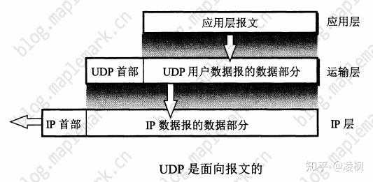
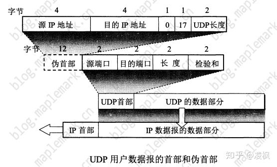
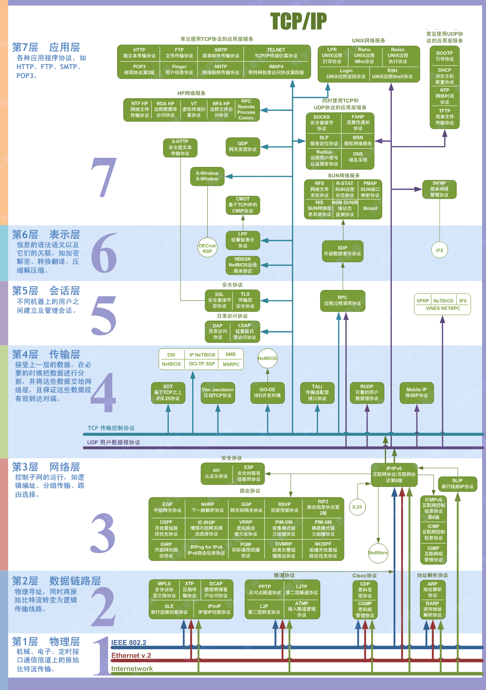
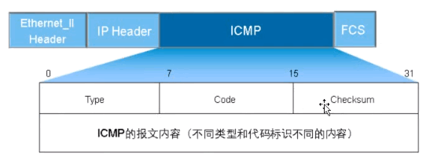

**计算机网络面经整理**

[计算机网络面试常考点](https://www.nowcoder.com/discuss/1937)

[常见计算机网络面试题](https://zhuanlan.zhihu.com/p/24001696)

[搞定计算机网络面试](https://juejin.im/post/6844903662838349838)

#### 1、TCP滑动窗口的概念?

**流量控制(滑动窗口):**

流量控制的目的是防止发送方发送数据的速率过快，接收方来不及接收。流量控制是通过滑动窗口来实现的。

滑动窗口表示发送方能够一次性批量发送数据的最大值，它的大小根据接收方的缓冲区的大小进行调整。在接收方返回确认消息时，接收方会把自己的缓冲区的剩余大小写入TCP首部的"窗口大小"的字段中。

**为什么需要滑动窗口:** 

使用滑动窗口是为了提高网络的吞吐量。如果每发送一个数据包后，都要等收到它的ACK再发送下一个数据包，这种做法的性能会非常差，尤其是在数据往返的时间比较长的时候。

使用滑动窗口可以一次性发送多个数据包，从而提高网络的性能。

**滑动窗口可能导致什么问题? 如何解决?**

滑动窗口可能导致死锁。如果接收方返回的确认消息中，窗口大小的字段为0，那么发送方就会将发送窗口置为0，停止发送数据；如果接收方之后发送的窗口大小不为0的数据包丢失了，发送方就在等待接收方的接收窗口不为0的消息，接收方在等待发送方发送的数据，进入了死锁。

使用"持续计时器"来避免死锁。每当发送方接收到了一个窗口大小为0的确认消息，就会停止发送数据；同时启动一个计时器，计时器时间一到发送方就主动发送数据包给接收方询问接收窗口的大小。

**滑动窗口为0时，发送方一般不能发送数据报。但是有两种特殊情况? 哪两种?**

* 可以发送紧急数据，比如用户终止在远端机上的运行进程
* 发送方可以发送一个1字节的数据报来向接收方询问接收窗口的大小，防止死锁。

[参考 TCP之流量控制](https://blog.csdn.net/dangzhangjing97/article/details/81008836)

#### 2、TCP和UDP的区别?

* TCP是面向连接的(三次握手建立连接、四次挥手释放连接)，UDP是无连接的
* 由于TCP是面向连接的，所以TCP只支持一对一的通信；UDP支持一对一、一对多、多对一、多对多的通信
* TCP提供可靠传输，即通过TCP传输的数据无差错、不丢失、不重复且按序到达；UDP尽最大努力交付，即不保证可靠交付
* TCP有流量控制、拥塞控制；UDP没有
* TCP面向字节流；UDP面向报文，既不合并也不拆分

#### 3、TCP为什么比UDP稳定? 或者问TCP为什么能保证可靠传输?

* 三次握手建立连接，四次挥手关闭连接
* 序列号和确认应答机制
* 流量控制
* 慢启动和拥塞控制
* 超时重传
* CRC校验

#### 4、拥塞控制

**为什么要进行拥塞控制?**

因为路由器有一个数据包处理队列，当路由器接收到的数据包太多处理不过来时，就会导致数据包处理队列过长，于是路由器就会无条件的丢弃新到达的数据包。

**而发送方会以为发送的数据包在网络中丢失，进而重传数据包；重传的数据包又会被无条件丢失；**

如此以往，就会导致网络性能急剧下降。

**拥塞控制的对象**

整个网络。

**拥塞控制的核心算法**

**慢开始、拥塞避免、快重传、快恢复。**

发送方维护一个拥塞窗口的状态变量，一般来说，发送方会让发送窗口的大小等于拥塞窗口；如果考虑到流量控制，发送窗口的大小可能小于拥塞窗口的大小；

* **慢开始算法**

当拥塞窗口的大小 < 慢开始门限时，每经过一个传输轮次，拥塞窗口的大小变为原来的2倍

* **拥塞避免算法**

当拥塞窗口的大小 > 慢开始门限时，每经过一个传输轮次，拥塞窗口的大小加1；如果发送方发现网络发生拥塞的话，执行乘法减小算法(**将慢开始门限置为拥塞窗口的一半**)，然后将拥塞窗口的大小置为1，重新执行慢开始算法。

* **快重传**

不使用快重传算法的情况: 发送方每发送完一个数据包之后都会为该数据包设定一个超时计时器，如果计时器时间到达之后还没有收到确认，就认为网络出现了拥塞，于是将慢开始门限值置为拥塞窗口的一半，然后将拥塞窗口的值置为1，重新执行慢开始算法。

快重传算法: 

快重传算法要求接收方每收到一个失序的数据包就立即发出重复确认(让发送方及早知道有报文段丢失)，而不是等到自己发送数据的时候捎带确认。

快重传算法还规定: 发送方只要连续收到了3个重复的确认后，立即重传对方尚未收到的数据包；不需要等待该数据包的超时定时器时间到达。

* **快恢复**

快恢复是与快重传配合使用的一个算法。

当发送方连续收到了3个重复的确认消息，认为网络很可能没有发送拥塞；于是执行乘法减小的过程，同时令拥塞窗口的大小等于执行了乘法减小后的ssthresh，执行拥塞避免算法。

[参考 快重传和快恢复算法](https://blog.csdn.net/hust_dxxxd/article/details/52270572)

#### 5、超时和连续收到了3个重复的ACK，拥塞窗口的大小是一样的吗?

不一样的。

* 发送方判断超时，执行乘法减小过程，同时将拥塞窗口的大小置为1，重新执行慢开始算法
* 连续收到了3个重复的ACK，不一定是网络拥塞，执行快恢复算法: 执行乘法减小的过程，同时令拥塞窗口的大小等于ssthresh

#### 6、三次握手? 为什么需要三次握手? 三次握手改成两次握手会怎么样?

**三次握手:** 

客户端向服务器发送一个数据包，内容为: SYN=1, seq=x

服务器向客户端发送一个数据包，内容为: SYN=1, ACK=1, ack=x+1, seq=y

客户端再向服务器发送一个数据包，内容为: ACK=1, ack=y+1, seq=x+1

连接建立成功。

**为什么需要三次握手?**

**三次握手的目的是为了防止已经失效的连接请求报文突然又传送到了服务端，导致发生错误。**

比如: client发出的第一个连接请求报文段并没有丢失，而是在某个网络结点长时间滞留了，以致于延误到连接释放以后的某个时间才到达server。本来这是一个早已失效的报文段，但是server收到此失效的连接请求报文段后，就误以为是client再次发出的一个新的连接请求，于是就向client发出确认报文段，同意建立连接。**假设不采用"三次握手"，那么只要server发出确认，新的连接就建立了，但是client并没有发出建立连接的请求，不会理会server的确认消息，也不会向server发送数据，但是server却以为新的连接已经建立，并一直等待client发来数据。**

如果没有采用"三次握手"，这种情况下server的资源就白白浪费掉了。

**如果三次握手改成两次握手会怎么样?**

如果只有两次握手，只有客户端确认了自己的起始序列号；服务器的起始序列号没有得到确认；

[参考TCP为什么是三次握手，而不是两次握手](https://blog.csdn.net/lengxiao1993/article/details/82771768)

#### 7、四次握手

为什么需要四次握手呢?

因为TCP是全双工模式，当client发出FIN报文段时，只是表示client已经没有数据要发送了，当server返回ACK报文段时，表示它已经知道client没有数据发送了；但是此时只是关闭了从client到server方向的通信，server还是可以向client发送数据的。当server向client发送FIN报文段时，表示server没有数据发送了，然后client向server发送确认报文段，进入Time_wait状态。两个方向上的传送都关闭了。

#### 8、Time-wait状态发生在哪一端? 为什么需要Time-wait状态?

* Time-wait状态发生在主动关闭TCP连接的一端
* 主动方在发送了最后的确认消息后，进入Time-wait阶段，等待2MSL之后关闭连接；被动方在收到了最后的确认消息后，立即关闭连接。主动方发送的确认消息可能会丢失，被动方在规定时间内没有收到确认消息，将再次发送FIN报文段，主动方收到后需要重新发送确认消息，因此主动方需要等待2MSL，等待被动方正常关闭后再关闭连接。

[参考TCP为什么会有Time-wait状态](https://blog.51cto.com/11859650/1917938)

#### 9、UDP协议介绍

UDP协议，即用户数据报协议。UDP的特点如下: 

* UDP是无连接的
* UDP尽最大努力交付，即不保证可靠交付
* UDP是面向报文的，发送方的UDP对应用程序交下来的报文，既不合并也不拆分，而是保留这些报文的边界，添加首部后就向下交付给IP层

**UDP的首部为8个字节，比TCP的首部(最少20个字节)开销更小**。UDP首部包含4个字段: 

* 源端口
* 目的端口
* 长度: UDP用户数据报的长度，最小值为8(仅有报文)
* 校验和: 用于检测UDP用户数据报在传输过程中是否有差错，有错就直接丢失

伪首部的作用: 伪首部的长度为12个字节，仅仅是在计算检验和的时候临时添加在UDP数据报前面的，既不向下传递也不向上递交。

[UDP协议简介](https://zhuanlan.zhihu.com/p/64154915)

#### 10、UDP协议如何实现可靠传输

UDP协议本身就是不可靠的传输协议，工作在传输层。要实现可靠的UDP协议，只能在应用层实现。

模仿TCP可靠传输的方式: 

* 添加序列号和确认应答机制，确保数据发送到对方
* 在发送方和接收方设置缓冲区，添加超时重传机制
* 在网络情况比较差的情况下会频繁丢包，为了避免越丢包越重传的恶性循环，还应该模仿TCP在发送方设置一个发送窗口，来控制发送方发送数据的速度；其实就是TCP协议中的拥塞控制。

#### 11、输入一条URL，发生了什么?

* DNS地址解析，得到URL对应的IP地址
* 建立TCP连接
* 发送HTTP请求
* 服务器处理HTTP请求
* 服务器返回响应结果
* 关闭TCP连接
* 浏览器解析HTML
* 浏览器进行页面渲染

[参考 细说浏览器输入URL发生了什么](https://segmentfault.com/a/1190000012092552)

#### 12、TCP和UDP的应用场景? 应用举例

* TCP适用于对准确性要求较高的场景，比如：文件传输、远程登录等
* UDP适用于对准确性要求不高，对实时性要求较高的场景：比如视频会议、QQ电话等

#### 13、http和https的区别?

* http明文传输，https加密传输
* https需要到CA申请SSL证书，http不需要
* http使用80端口，https使用443端口
* http比https页面响应速度更快。因为http协议使用TCP的三次握手建立连接，客户端与服务器只需要交换3个数据包；https除了TCP三次握手的三个数据包以外，还需要加上SSL握手的9个数据包，一共需要交换12个数据包。

#### 14、循环冗余校验码的计算过程

* 将生成多项式转换为R+1位的二进制数，校验码的位数为R位
* 将信息码左移R位
* 用左移后的信息码除以生成多项式，得到余数
* 拼接到信息码左移后空出来的位置，得到了最终编码

[参考 如何计算CRC校验码](https://blog.csdn.net/Kj1501120706/article/details/73330526)

#### 15、DNS域名解析的过程

**DNS域名解析的目的**

将域名如www.kuaishou.com翻译为对应的IP地址。 解析过程大概有下面几个步骤:

* 浏览器先到浏览器缓存中查找看能否找到该域名，如果命中了就找到了对应的IP地址了；
* 如果浏览器缓存中没有命中，就转去查找系统的缓存文件hosts，看能否找到对应的域名；
* 如果系统中的缓存文件中也没有找到对应的域名，将通过计算机上的DNS客户端向本地域名服务器发送一个查询请求；
  * 如果使用的是校园网，那么一般会有一个校园内的本地域名服务器LDNS
  * 如果使用的是小区网，那么LDNS就是运营商提供的
  * 一般到这里就可以找到域名对应的IP地址了
* 如果在本地域名服务器中还没有找到对应的域名的话，将由本地域名服务器向根服务器发送一个查询请求，然后根服务器会返回一个地址，告诉本地域名服务器到这个地址指向的顶级域名服务器中查询；
* 然后顶级域名服务器查找到域名对应的IP地址，先返回给本地域名服务器，然后由本地域名服务器进行缓存后返回给计算机；计算机再进行缓存

**DNS域名解析中涉及的两个概念:** 

* 递归查询: 客户端向本地服务器发起查询请求的过程为递归查询
* 迭代查询: 客户端向根服务器发出查询请求，然后根服务器返回一个地址，然后客户端再向该地址指向的服务器发起查询请求；这个过程为迭代查询

[参考DNS域名解析的过程](https://www.cnblogs.com/xrq730/p/4931418.html)

#### 17、五层协议的体系结构

从下至上为: 

* 物理层
* 数据链路层
* 网络层
* 运输层
* 应用层

#### 18、TCP/IP的体系结构

从下至上为:

* 网络接口层
* 网际层IP
* 运输层
* 应用层

#### 19、简述ARQ协议(自动重传请求)

ARQ协议包括"停止等待ARQ协议"和"连续ARQ协议"。

**停止等待ARQ协议**

* 发送端发送完分组M1后，就暂停发送，等待B的确认
* 接收端收到M1分组就向发送端发送确认
* 发送端收到对M1的确认后，继续发送下一个分组M2

如果A传送的过程中分组丢失了，或者B在接收M1时检测出了差错，就丢弃M1，然后B什么也不做。

A只要超过了一段时间仍然没有收到确认，就认为刚才发送的分组丢失，重新发送刚刚发送过的分组。这就是**超时重传**。

**超时重传：**

* 发送方每次发送完一个分组后，就会设置一个超时计时器（计时器的时间略长于分组传送的往返时间）
* 超时计时器时间到期还没有收到确认消息，就重新发送刚才发送的分组
* 如果在超时计时器的时间内收到了确认消息，就撤销超时计时器

停止等待ARQ协议的优点是简单，**缺点是"对信道的利用率太低"**。

**连续ARQ协议:** 

连续ARQ协议允许连续发送一组数据包，然后再等待这些数据包的ACK。

**连续ARQ协议一般是结合滑动窗口协议一起使用的。**

发送方维护一个发送窗口，位于发送窗口内的分组可以连续发送出去，不需要等待对方的确认。

**连续ARQ协议规定**: 发送方每收到一个确认，就把发送窗口向前滑动一个分组的位置。另外，接收方一般是采用累积确认的方式，在收到了几个分组后，对按序到达的最后一个分组发送确认。如果收到了这个分组的确认信息，则表示到这个分组为止的所有分组都已经正确收到了。

**什么是Go-back-N机制?**

累积确认的缺点是"不能正确的向发送方反映出接收方已经正确收到的所有分组的信息"。

比如说：发送方发送了5个分组，但是中间的第三个分组丢失了，于是接收方只能对前2个发送确认，发送方只能把后面的3个分组都重传一次。这种机制就是Go-back-N。

[参考 TCP连续ARQ协议](https://blog.csdn.net/guoweimelon/article/details/50879588)

#### 20、简述滑动窗口协议

滑动窗口协议在发送方和接收方之间各自维持一个滑动窗口，发送方是发送窗口，接收方是接收窗口，这个窗口随着时间变化可以向前滑动的。

滑动窗口协议规定:

* 凡是已经发送过的数据，在未收到确认之前，都必须暂时保留，以便在超时重传时使用。
* 只有当发送方A收到了接收方的确认报文段时，发送方发送窗口才可以向前滑动几个序号
* 当发送方A发送的数据经过一段时间没有收到确认，就要使用回退N步协议，回退到最后接收到确认号的地方，重新发送这部分数据。

注意：

* TCP的滑动窗口是以字节为单位的
* 发送窗口的大小取决于接收端的窗口大小和拥塞窗口大小

[参考 TCP滑动窗口协议](https://blog.csdn.net/guoweimelon/article/details/50879588)

[参考 TCP协议之流量控制](https://blog.csdn.net/wbw1985/article/details/4879224)

#### 21、简述HTTP协议? TCP/IP协议、IP协议与HTTP协议的关系?   

**什么是http?**

http是超文本传输协议，是一个基于请求和响应、无状态的应用层协议，基于TCP协议来传输数据，在万维网上传输的所有www文件都必须要遵守这个标准。

http的特点如下: 

* **无状态**: 对客户端没有状态存储，对事物处理没有"记忆"能力，比如访问一个网站需要反复进行登录操作
* **无连接**: 在http1.1之前，由于无状态的特点，每次请求都要经过三次握手和四次挥手，耗费不必要的时间和流量
* **基于请求和响应**: 客户端请求，服务器响应
* **通信使用明文传输**

**什么是https?**

https是身披SSL的HTTP。它使用HTTP进行通信，利用SSL协议建立安全信道，加密数据包。

https的特点如下: 

*  内容加密: 采用混合加密技术，中间者无法直接查看明文内容
* 验证身份: 通过证书认证客户端访问的是自己的服务器
* 保护数据完整性: 防止传输的内容被中间人冒充或者篡改

**HTTP协议和TCP、IP协议的关系**

HTTP协议是应用层协议，在传输层使用TCP协议，在网络层使用IP协议。

* IP协议解决网络路由寻址问题
* TCP协议解决如何在IP层之上可靠传输的问题

[分析HTTP、TCP的长连接和短连接以及Sock](https://www.zhoulujun.cn/html/webfront/SGML/web/2015_1016_317.html)

#### 22、简单说一下你了解的端口以及对应的服务?

| 端口 |            服务            |
| :--: | :------------------------: |
|  21  |   FTP服务(文件传输协议)    |
|  25  | SMTP协议(简单邮件传输协议) |
|  80  |          HTTP协议          |
| 443  |         HTTPS协议          |
| 3306 |         Mysql服务          |
| 1080 |  Socket代理服务使用的端口  |
|  53  |       DNS域名服务器        |

#### 23、什么是子网掩码? 为什么要子网掩码?

**IPv4地址是一个32位的二进制数，通常被分割为4个"8位二进制数"。为了方便阅读，IP地址通常使用"点分十进制"来表示。**在一个子网中，第一个和最后一个为保留地址，所以在一般情况下局域网中可使用的IP为1~254。

**子网掩码是一个32位的二进制值，它可以从IP地址中分离出网络号和主机号。**

通过子网掩码解析网络号和主机号的过程如下: 

将子网掩码和IP地址都写成二进制的形式: 

* 子网掩码和IP地址做"与"运算，即可得到网络地址
* 子网掩码的二进制形式先取反，然后与IP地址做"与"运算，即可得到主机地址

**子网掩码分类:** 

* 缺省子网掩码: 网络号全为1，主机号全为0
* 自定义子网掩码: 网络号+子网号+子网主机号，主机号位置划分出来了一部分给子网用

[参考子网掩码详解](https://blog.csdn.net/jason314/article/details/5447743)

#### 24、简单解释一下ARP协议的工作过程?

**什么是MAC地址?**

MAC地址，也就是物理地址，它是网络设备生产厂商写在硬件内部的。一般不可改变。

**MAC地址的长度为48位(6个字节)**，通常表示为12个16进制数，每两个16进制数之间用冒号隔开，如: 08:00:20:0A:8C:6D。

**ARP协议的工作原理**

ARP协议负责从IP地址解析出对应的MAC地址。

* 数据链路层需要将网络层传下来的数据包封装成帧，其中要添上源MAC地址和目的MAC地址。但是网络层传下的数据包中只含有目的IP地址。根据这个IP地址，可以找到下一跳的IP地址。
* 于是ARP进程首先去查找ARP高速缓存表，如果找到对应的IP地址，也就解析出来了MAC地址；
* 如果ARP高速缓存表没有命中，ARP进程在本地局域网中发送ARP请求广播，询问目的IP地址对应的MAC地址；在本地局域网中的所有主机上运行的ARP进程都会收到此ARP请求。如果主机的IP地址与要询问的IP不一样，则丢弃该帧；如果主机的IP地址与要查询的IP地址相同，先将对方的IP地址和MAC地址添加到自身的ARP高速缓存表中；然后向询问主机发送单播ARP响应，告诉它自己的MAC地址。
* 询问主机收到ARP响应后，会把对应的IP地址和MAC地址添加到ARP高速缓存表中。

**ARP协议注意的问题**

**ARP协议是局域网内部的协议，它解决的同一局域网内部的主机或者路由器的IP地址和对应的MAC地址的映射问题**。无法解析到其它网络中的主机的硬件地址。

实际上，也不需要解析其它网络的硬件地址，因为跨网络的数据传输一般是由上层协议来完成的。

[参考ARP协议详解](https://juejin.im/entry/6844903666445451272)

[参考MAC地址、IP地址、ARP协议讲解视频](https://www.bilibili.com/video/BV1rC4y1s7CJ?from=search&seid=4946876740271951137)

#### 25、说一说OSI七层网络模型?

* 应用层
  * 各种应用层协议: HTTP、HTTPS、FTP、SMTP等等
* 表示层
  * 信息的表示，比如加密、解密、压缩、解压缩等
* 会话层
  * 负责在不同的机器之间建立和管理会话
* 传输层
  * 数据传输协议: TCP、UDP
* 网络层
  * 分组传输、路由选择等。该层协议有: ICMP协议、IGMP协议、ARP协议等
* 数据链路层
  * 负责数据的点对点传输
  * PPP点对点隧道协议等
* 物理层
    * 主要是制定了电气、机械等一些接口的规约

看下面这张图更加清晰: 

#### 27、NAT协议

#### 28、DHCP协议

#### 30、DNS劫持什么意思? 怎么防范?

**DNS劫持**

客户端在向DNS服务器查询某个域名对应的IP地址时，被冒充者截获了，然后冒充者冒充DNS服务器返回一个假的IP地址。于是客户端根据这个IP地址就访问到了一个冒充的网站上去了。

DNS劫持的手段可能有下面多种方法: 

* 本地DNS劫持: 修改本地hosts文件、浏览器缓存等
* 路由DNS劫持
* 攻击本地DNS服务器
* ARP欺骗

**DNS劫持的防范方法**

* 本地开启防火墙，加强病毒检查
* 定期清空路由器的DNS缓存，防止攻击者修改路由器的DNS配置
* 用HTTP DNS代替Local DNS

[参考 你需要知道的DNS劫持](https://juejin.im/post/6844903863623876622)

#### 31、集线器、交换机、路由器的区别?

**集线器**

集线器上面有很多个接口，可以将局域网上的所有的网络设备连接起来，但是集线器不会过滤任何的数据，也无法识别数据的目标位置。当其中一个端口收到数据包时，集线器会把这个数据包复制给其它所有端口，其它所有网络设备都可以收到这个数据包。

集线器的缺点: 

* 将数据包发给所有与集线器连接的网络设备，造成安全隐患
* 浪费带宽

**交换机**

交换机上面也有很多个端口，用来与局域网上的其它网络设备连接。与集线器不同的是，交换机可以获取与其连接的网络设备的MAC地址，保存在面板上。

当有数据包发送到交换机时，交换机会去解析数据包中的MAC地址，根据这个地址发送给特定的端口。

**路由器**

集线器和交换机都只能实现局域网内部的网络通信。如果要在互联网上通信，需要使用路由器。路由器是工作在网络层的。

在路由器中维护了一个路由表，路由表上记录了不同的网段对应的端口。当路由器收到了一个数据包之后，会从IP数据报中解析出IP地址，查询路由表看是否有对应的IP地址，如果找到了则从对应的端口转发出去；如果没有，则IP地址与子网掩码相与得到对应的网段，然后查询路由表找到对应的端口转发。

**注意: 交换机工作在数据链路层、路由器工作在网络层**

[集线器、交换机、路由器的工作原理及其区别](https://www.bilibili.com/video/BV1LC4y187Ew?from=search&seid=15716898546218216683)

#### 32、HTTP和HTTPS详细介绍

 **为什么有了HTTP，还要HTTPS?**

* HTTP不安全，采用明文传输
* HTTP没有身份认证
* HTTP的发送方和接收方都不会去验证报文的完整性，HTTP报文的内容可能会被篡改

**HTTPS的全称是安全的超文本传输协议，具有如下特点:** 

* 数据加密
* 保证数据一致性
* 进行身份认证

HTTPS实际上是HTTP+SSL协议，对HTTP存在的三个问题进行逐一解决。

**通信加密**

SSL采用混合加密的方式，混合加密即同时采用对称加密和非对称加密。

* **对称加密**

对称加密中加密和解密使用的是同一个密钥。

使用对称加密的前提是通信双方提前约定好加密规则(密钥)，但是这在开放互联网中是不可取的。因为与服务器进行交互的客户端有很多可能之前是完全不认识的，所以也不存在提前约定好的密钥。只能通过网络把密钥发送给对方，但是没有经过加密的数据，在网络中传输本来就是不安全的。

* **非对称加密**

非对称加密使用成对的公钥和私钥，私钥由自己保管，公钥可以发送给互联网上的任何人。公钥和私钥是完全没有关联的，不可以互推。

使用非对称加密可以解决在网络上密钥交换的问题: 公钥-私钥都保存在服务器上，服务器可以随意分发公钥，客户端使用公钥进行加密然后传输；服务器收到内容后，使用自己服务器上私钥进行解密。服务器也可以使用私钥对数据进行加密发送，客户端收到数据后使用公钥进行解密。因为私钥是直接保存服务器上，没有经过网络交换，所以是安全的。

* **混合加密**

非对称加密虽然比对称加密更加安全，但是相比对称加密而言，非对称加密的解密速度非常慢。因此SSL使用混合加密的方式。

首先使用非对称加密的方式，在服务器和客户端之间交换对称加密的密钥。然后再使用对称加密的密钥在客户端和服务器之间加密传输数据。

**身份验证**

HTTP没有进行身份验证，所以服务器的身份可以被伪装，造成安全问题。SSL协议使用数字证书来进行身份验证。

数字证书的使用流程如下: 

1. 服务器先从一个大家都信任的第三方机构申请一个数字证书
2. 客户端向服务器通信之前，先请求获得服务器的数字证书，然后服务器将自己的数字证书发送给客户端
3. 客户端收到证书之后，向第三方机构验证
4. 验证通过后客户端与服务器之间方可进行正常的通信

**解决内容的一致性问题 >>> 数据签名**

HTTP不会对数据的完整性进行验证，这样的话就算通信的数据在网络中途被篡改了，通信双方也无法知道。SSL协议使用数字签名来解决这个问题。

数字签名主要有两个作用: 

* 验证数据是否被篡改
* 验证数据是否是意向的对象发出的

**如何验证数据是否被篡改?**

发送方对需要发送的内容进行摘要。过程如下: 首先发送方利用约定好的哈希算法，对要发送的内容进行哈希映射得到哈希值，这个哈希值作用内容的摘要进行发送。

接收方接收到数据之后，首先利用约定好的哈希算法，对要发送的内容进行哈希映射得到哈希值，然后与发送方发过来的摘要进行比对，就可以判断出发送的内容是否被篡改过。

**如何判断数据是否是意向的对象发出的?**

发送方对内容的摘要进行签名，签名技术的原理是非对称加密。

发送方使用自己的公钥(私钥)对摘要进行加密，然后接收方使用私钥(公钥)对摘要进行解密，如果可以解密，那就说明内容是意向的对象发送的，因为公钥-私钥是配对的。

**SSL的单向认证过程**

1. 客户端从服务器获得数字证书和数字签名
2. 通过浏览器内置的CA机构找到对应的公钥对数字签名进行解密得到内容摘要，然后用CA机构的摘要算法计算数字证书的摘要
3. 对比计算的摘要和从服务器获得的摘要
4. 如果一致，说明内容是服务器发过来的。可以从数字证书中获得服务器的公钥
5. 客户端生成对称密钥，使用公钥进行加密，发送给服务器
6. 服务器接收加密的对称密钥，使用私钥进行解密
7. 完成对称密钥的协商，后续就可以使用对称密钥加密内容进行通信了

**HTTP短连接**

在HTTP/1.0中，默认使用的是短连接。也就是说，在浏览器和服务器之间，每进行一次HTTP操作，就建立一次连接，任务结束后中断连接。

如果浏览器访问的某个HTML或者其它类型的Web页面中包含有其它的Web资源，比如JavaScript文件、CSS文件等，浏览器每遇到一个这样的Web资源，就会建立一个HTTP会话。

短连接的优点：管理简单，存在的连接都是有用的连接，不需要额外的控制手段

短连接的缺点：如果客户端请求频繁的话，会在TCP连接的建立和关闭操作上浪费时间和带宽。

**HTTP长连接**

从HTTP/1.1起，默认使用长连接。使用长连接的HTTP协议，会在响应头中加入: 
$$
Connection: keep-alive
$$
在使用长连接的情况下，当一个网页打开完成后，客户端和服务器之间用于传输数据的TCP连接不会关闭；如果客户端再次访问服务器上的网页，会继续使用这一条已经建立好的TCP连接。长连接并不会永久保持连接，它有一个保持的时间，在不同的服务器软件中也可以设定这个时间。

长连接的优点：避免了较多的TCP连接建立和关闭的操作，节约时间

长连接的缺点：如果client和server之间的连接长时间不关闭的话，随着客户端连接越来越多，服务器的压力就会越来越大

**HTTP长连接什么时候关闭呢?**

客户端与服务器之间的连接一直保持，如果客户端已经消失了，服务器上就会保留一个半开放的连接，它会一直等待来自客户端的数据。**TCP保活功能试图在服务器上检测到这种半开放的连接，一旦检测到，服务器会终止连接。**

如果一个给定的连接在两小时内没有任何工作，服务器就会向客户端发送一个探测报文段，客户端必须处于下面4个状态之一: 

* **客户端正常运行，并且从服务器可达。**说明客户端的TCP响应正常，服务器将保活定时器复位。
* **客户端已经崩溃，并且关闭或者正在重启。**这种情况下，客户端的TCP不会进行响应，服务器无法收到响应，将在75秒后超时。服务器总共会发送10个这样的探测，每个间隔75秒。如果服务器没有收到一个响应，则认为客户端已经关闭，服务器终止连接。
* **客户端已经崩溃，并且已经重新启动了**。服务器会收到一个复位的响应，告诉服务器关闭连接。
* **客户端正常运行，但是从服务器不可达**。与2类似。

**HTTP的get和post方法的区别?**

1. GET请求的参数通过URL传递，是直接暴露在外面的；POST请求的参数放在Request body中的；所以相对于GET, POST请求更安全
2. GET请求在URL中传递的参数有长度限制，一般为2KB; POST没有限制
3. GET请求会被浏览器主动保存在历史记录中；POST不会，除非手动设置；

**HTTP的get和post的使用场景:** 

* get请求一般适用于一问一答的场景，比如说在百度搜索上输入一个词条，一般是使用GET请求
* post请求一般用于包含有敏感信息或者比get包含更多信息的请求当中

参考内容: 

[HTTP原理和通信流程](https://cloud.tencent.com/developer/article/1592434)

[HTTPS是如何加密的](https://cloud.tencent.com/developer/article/1592434)

[HTTPS原理](https://juejin.im/post/6844903856401285133)

[HTTP长连接和短连接详解](https://www.cnblogs.com/0201zcr/p/4694945.html)

[get和post的区别](https://www.bilibili.com/video/BV1vJ411q7NS?from=search&seid=1303644246549853000)

#### 33、ICMP协议? ICMP协议的典型应用?

**ICMP协议(网络控制消息协议)的原理**

ICMP协议的数据包有两种: ICMP echo request、ICMP echo reponse。

ICMP数据包格式如下: 

**ICMP协议是基于IP协议工作的，也就是说ICMP报文包含在IP数据报中。当IP报头中的协议字段为1时，说明这是一个ICMP报文。**

ICMP字段说明: 

* type: 1字节，标识ICMP报文的类型(两种: 取值为1~127的差错报文和取值为128以上的信息报文)
* code: 与type共同标识了ICMP报文的详细类型
* Checksum: 校验和，用于检验报文在传输过程中是否出现了差错

**使用ICMP协议的两个典型应用:** 

* ping: 判断源主机和目的主机之间的网络是否连通
    * 源主机上ping进程向目的主机发送多个ICMP echo请求报文，根据接收到ICMP echo响应报文的时间来计算时延
* tracert: 可以找出从主机到目的地址所经过的所有路由器的信息

**tracert追踪路由器的原理:** 

tracert程序的实现主要涉及到IP数据包头部"TTL"字段的使用，TTL字段指定了数据报的生存时间，这样可以防止数据包由于选路错误或者其它原因导致在网络中无休止的流动。

TTL的初始值由源主机设置，当经过路由器时，路由器将TTL减1，因此TTL字段实际上是一个跳站计数器。

tracert的实现过程如下: 

* 源主机向目的主机发送一个ICMP回显请求报文，令TTL=1；
* 当该数据报抵达途中的第一个路由器时，TTL减为0，于是该数据包被丢弃；该路由器生成一份ICMP超时差错报文返回给源主机，源主机收到后解析该报文可以得到第一跳路由器的信息
* 然后源主机令TTL=2，重新向目的主机发送一个ICMP回显请求报文，可以得到第二跳路由器的信息
* 不断重复这个过程，直至数据包到达目的主机

[ICMP协议讲解视频](https://www.bilibili.com/video/BV1Bk4y167Hy?from=search&seid=15435959172016990221)

[tracert实现原理](https://blog.csdn.net/microtong/article/details/3220450)

#### 34、HTTPS握手的过程?

#### 35、cookie、session的作用和区别?

#### 36、HTTP多路复用?

**HTTP1中**

HTTP1中每发送一个HTTP请求都要建立一次TCP连接，其中要经历三次握手和四次挥手，同时由于TCP的慢启动机制导致传输速度慢。同时，浏览器对于同一个域名下的TCP连接有数量限制(一般6个)。

**HTTP1.1中**

在HTTP1.1中，默认启动长连接，即默认开启Connection: keep-alive。解决了每发送一个HTTP请求都要建立TCP连接的问题。但是，在同一时刻仍然只能发送一个HTTP请求，多个HTTP请求只能采用串行发送的方式，必须等待上一个请求接受才能发起下一个请求。

虽然1.1版本允许复用TCP连接，但是在同一个TCP连接里面，所有的数据通信都是按次序进行的。服务器只能处理完一个请求，才会去处理下一个请求。**要是前面的请求回应的特别慢，后面就会有许多请求排队等待，这种情况称为"队头阻塞"。**

**HTTP2中**

HTTP2中的两个非常重要的概念: 帧和流

* 流: 存在于TCP连接下的虚拟通道，可以承载双向消息。每一个流都有一个唯一的整数ID。每一个流都可以分成非连续多次发送
* 帧: HTTP2中数据传输的最小单位。每一帧都包含几个字段: length、type、stream identifier等。

在HTTP2.0中，在同一个TCP连接中，客户端和服务器可以同时发送多个请求和响应，实现了双向、实时、多工，避免了队头阻塞。由于在2.0中采用了数据流，对同一个请求和响应的数据数据包都做了独一无二的标识(整数ID)，所以不用等待发送。两端会根据标识对收到的帧进行组装。

[参考 第15题: 简单讲一下http2的多路复用](https://github.com/Advanced-Frontend/Daily-Interview-Question/issues/14)

[参考 http2中的多路复用](https://juejin.im/post/6844903935648497678)

#### 37、输入www.baidu.com找不到地址，可能是什么原因?

* 本地网络有问题
* 域名服务器关闭，解析不到对应的IP地址
* 访问的网页是以前的网页，现在不存在，也没有做跳转